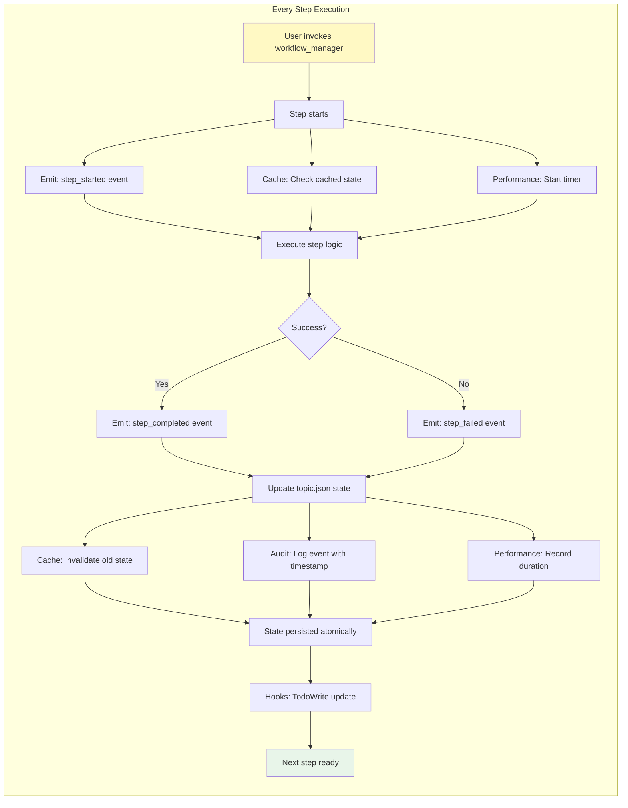

# agenthero-ai Agent - Complete User Flow

## Overview
This diagram shows the complete flow from invoking the agent to receiving deliverables.

## Complete User Flow Diagram

```mermaid
flowchart TD
    Start([User Invokes Agent]) --> Input[User provides spec file path]

    Input --> Init[Agent initializes workflow]
    Init --> CreateState[Create topic.json state file]
    CreateState --> EmitInit[Emit: workflow_initialized event]
    EmitInit --> Phase1

    %% PHASE 1: Requirements Analysis
    subgraph Phase1[" PHASE 1: Requirements Analysis "]
        P1Start[Emit: phase_started event] --> P1S1[Step 1: Parse specification file]
        P1S1 --> P1S2[Step 2: Extract requirements]
        P1S2 --> P1S3[Step 3: Extract deliverables]
        P1S3 --> P1S4[Step 4: Extract acceptance criteria]
        P1S4 --> P1S5[Step 5: Validate spec structure]
        P1S5 --> P1S6[Step 6: Generate requirements summary]
        P1S6 --> P1Wait[Step 7: Wait for user approval]
    end

    P1Wait --> UserApprove1{User approves<br/>requirements?}
    UserApprove1 -->|Yes| P1Complete[Mark Phase 1 complete]
    UserApprove1 -->|No| P1Revise[Revise requirements]
    P1Revise --> P1S2

    P1Complete --> EmitP1[Emit: phase_completed event]
    EmitP1 --> Phase2

    %% PHASE 2: Agent Selection
    subgraph Phase2[" PHASE 2: Agent Selection "]
        P2Start[Emit: phase_started event] --> P2S1[Step 1: Analyze requirements]
        P2S1 --> P2S2[Step 2: Scan agent library]
        P2S2 --> P2S3[Step 3: Select appropriate agents]
        P2S3 --> P2S4[Step 4: Justify agent selections]
        P2S4 --> P2S5[Step 5: Generate agent list]
        P2S5 --> P2Wait[Step 6: Wait for user approval]
    end

    P2Wait --> UserApprove2{User approves<br/>agent selections?}
    UserApprove2 -->|Yes| P2Complete[Mark Phase 2 complete]
    UserApprove2 -->|No| P2Revise[Revise selections]
    P2Revise --> P2S3

    P2Complete --> EmitP2[Emit: phase_completed event]
    EmitP2 --> Phase3

    %% PHASE 3: Execution Planning
    subgraph Phase3[" PHASE 3: Execution Planning "]
        P3Start[Emit: phase_started event] --> P3S1[Step 1: Create execution plan]
        P3S1 --> P3S2[Step 2: Generate agent prompts]
        P3S2 --> P3S3[Step 3: Define task dependencies]
        P3S3 --> P3S4[Step 4: Create state structure]
        P3S4 --> P3Wait[Step 5: Wait for user approval]
    end

    P3Wait --> UserApprove3{User approves<br/>execution plan?}
    UserApprove3 -->|Yes| P3Complete[Mark Phase 3 complete]
    UserApprove3 -->|No| P3Revise[Revise plan]
    P3Revise --> P3S1

    P3Complete --> EmitP3[Emit: phase_completed event]
    EmitP3 --> Phase4

    %% PHASE 4: Execution
    subgraph Phase4[" PHASE 4: Execution "]
        P4Start[Emit: phase_started event] --> P4S1[Step 1: Prepare task launch]
        P4S1 --> P4S2[Step 2: Present execution plan]
        P4S2 --> P4Wait[Step 3: Wait for launch approval]
        P4Wait --> UserApprove4{User approves<br/>launch?}
        UserApprove4 -->|Yes| P4S3[Step 4: Launch sub-agents]
        UserApprove4 -->|No| P4Cancel[Cancel execution]
        P4S3 --> Monitor[Monitor agent progress]
    end

    Monitor --> CheckComplete{All agents<br/>complete?}
    CheckComplete -->|No| Monitor
    CheckComplete -->|Yes| P4Complete[Mark Phase 4 complete]

    P4Complete --> EmitP4[Emit: phase_completed event]
    EmitP4 --> Deliverables

    %% Final Output
    subgraph Deliverables[" Final Deliverables "]
        D1[📁 Project-tasks/topic-slug/topicplan.md]
        D2[📁 Project-tasks/topic-slug/spec/]
        D3[📁 Project-tasks/topic-slug/deliverables/]
        D4[📄 .claude/agents/state/.../topic.json]
        D5[📊 Complete audit log]
    end

    Deliverables --> EmitComplete[Emit: workflow_completed event]
    EmitComplete --> End([✅ Workflow Complete])

    P4Cancel --> End

    %% Styling
    classDef phaseStyle fill:#e1f5ff,stroke:#0288d1,stroke-width:2px
    classDef userStyle fill:#fff9c4,stroke:#f57c00,stroke-width:2px
    classDef eventStyle fill:#f3e5f5,stroke:#7b1fa2,stroke-width:2px
    classDef delivStyle fill:#e8f5e9,stroke:#388e3c,stroke-width:2px

    class Phase1,Phase2,Phase3,Phase4 phaseStyle
    class UserApprove1,UserApprove2,UserApprove3,UserApprove4 userStyle
    class EmitInit,EmitP1,EmitP2,EmitP3,EmitP4,EmitComplete eventStyle
    class Deliverables delivStyle
```



## Behind the Scenes (Phase 2/3 Features)



## Key Components

### 1. State Management
- **topic.json**: Stores complete workflow state
- **Atomic writes**: No data loss on crashes
- **File locking**: Prevents concurrent conflicts
- **Caching**: 60-70% reduction in file I/O

### 2. Event System
- **8 event types**: workflow_started, step_completed, etc.
- **Event bus**: Pub/sub architecture
- **Hooks**: TodoWrite integration with throttling
- **Audit log**: Complete history of all events

### 3. User Approval Points
- ✋ End of Phase 1 - Approve requirements
- ✋ End of Phase 2 - Approve agent selections
- ✋ End of Phase 3 - Approve execution plan
- ✋ Start of Phase 4 - Approve agent launch

### 4. Final Output Structure
```
Project-tasks/
└── {topic-slug}/
    ├── topicplan.md          # Complete plan
    ├── spec/
    │   └── original-spec.md  # User's spec file
    └── deliverables/         # Agent outputs

.claude/agents/state/agenthero-ai/topics/{topic-slug}/
└── topic.json                # Complete state + audit log
```

## CLI Commands Available

| Command | Purpose | Phase |
|---------|---------|-------|
| `initialize_workflow` | Start new topic | Setup |
| `get_workflow_status` | View progress | Any |
| `get_next_step` | Get next pending step | Any |
| `start_step` | Mark step in progress | Any |
| `complete_step` | Mark step done | Any |
| `fail_step` | Mark step failed | Any |
| `get_audit_log` | View event history | Any |
| `validate_settings` | Check settings.json | Setup |

## Success Metrics

- ✅ 4 phases completed
- ✅ 22 steps executed
- ✅ 4 user approvals given
- ✅ All sub-agents completed
- ✅ Deliverables created
- ✅ Audit log complete

