# CS Project Task - Architecture & Flow

## Complete System Flow Diagram

```mermaid
sequenceDiagram
    participant User
    participant Claude
    participant PM as PM Orchestrator<br/>(csprojecttask)
    participant Library as Agent Library<br/>(README.md)
    participant SubAgent1 as Sub-Agent 1<br/>(market-research)
    participant SubAgent2 as Sub-Agent 2<br/>(feature-comparison)
    participant SubAgent3 as Sub-Agent 3<br/>(pricing-research)
    participant State as State Files<br/>(JSON)
    participant Monitor as Monitor<br/>(Dashboard)

    User->>Claude: "Research SubsHero competitors"
    Claude->>PM: Invoke csprojecttask agent

    Note over PM: Session Start
    PM->>State: Check for active topics
    State-->>PM: topics.json data

    PM->>PM: Analyze user request
    Note over PM: "Need: market, features, pricing"

    PM->>Library: Scan agent library
    Library-->>PM: Available agents:<br/>- market-research-analyst ✅<br/>- feature-comparison-analyst ✅<br/>- pricing-research-analyst ✅

    Note over PM: Create Execution Plan
    PM->>PM: Task 1: Market (market-research-analyst)<br/>Task 2: Features (feature-comparison-analyst)<br/>Task 3: Pricing (pricing-research-analyst)<br/>Dependencies: None (parallel)

    PM->>User: 📋 Execution Plan<br/>3 tasks, 3 agents (reused)<br/>Parallel execution
    User->>PM: ✅ Approve

    Note over PM: Initialize State Files
    PM->>State: Create topic.json
    PM->>State: Create pm-state.json
    PM->>State: Create task-001.json (market)
    PM->>State: Create task-002.json (features)
    PM->>State: Create task-003.json (pricing)

    Note over PM: Launch Sub-Agents in Parallel
    PM->>SubAgent1: Task(market-research-analyst)<br/>STATE_FILE: task-001.json
    PM->>SubAgent2: Task(feature-comparison-analyst)<br/>STATE_FILE: task-002.json
    PM->>SubAgent3: Task(pricing-research-analyst)<br/>STATE_FILE: task-003.json

    Note over SubAgent1,SubAgent3: Sub-Agents Work Autonomously

    SubAgent1->>State: Read task-001.json
    SubAgent1->>State: append_log("Starting research", 10%)
    SubAgent1->>SubAgent1: Research competitors
    SubAgent1->>State: append_log("Found 8 competitors", 50%)
    SubAgent1->>SubAgent1: Analyze positioning
    SubAgent1->>State: append_log("Analysis complete", 90%)
    SubAgent1->>State: set_task_result("Market analysis complete")
    SubAgent1->>State: Update status: completed, 100%

    SubAgent2->>State: Read task-002.json
    SubAgent2->>State: append_log("Starting feature analysis", 15%)
    SubAgent2->>SubAgent2: Analyze features

    Note over SubAgent2: Sub-Agent Needs Clarification
    SubAgent2->>State: set_blocking_question(<br/>"Which features are priority?",<br/>"Found 50+ features"<br/>)
    SubAgent2->>State: Update status: blocked

    Note over PM: PM Monitoring Loop
    PM->>State: Read all task states
    State-->>PM: task-001: completed ✅<br/>task-002: blocked ⚠️<br/>task-003: in_progress 🔄

    PM->>PM: Detect blocking question in task-002
    PM->>User: ⚠️ Sub-Agent Blocked<br/>Task: task-002<br/>Question: "Which features are priority?"<br/>Context: "Found 50+ features"
    User->>PM: "Focus on core billing features"

    PM->>State: answer_question(task-002, "Focus on core billing features")
    PM->>State: Update status: in_progress

    SubAgent2->>State: Read answer from state file
    SubAgent2->>SubAgent2: Continue with answer
    SubAgent2->>State: append_log("Focusing on core billing", 60%)
    SubAgent2->>State: set_task_result("Feature analysis complete")
    SubAgent2->>State: Update status: completed, 100%

    SubAgent3->>State: Read task-003.json
    SubAgent3->>State: append_log("Analyzing pricing models", 30%)
    SubAgent3->>SubAgent3: Research pricing
    SubAgent3->>State: append_log("18 competitors analyzed", 80%)
    SubAgent3->>State: set_task_result("Pricing analysis complete")
    SubAgent3->>State: Update status: completed, 100%

    Note over Monitor: Real-Time Monitoring
    Monitor->>State: Poll task states (every 6s)
    Monitor->>User: Display progress:<br/>task-001: 100% ✅<br/>task-002: 60% 🔄<br/>task-003: 80% 🔄

    Note over PM: All Tasks Complete
    PM->>State: Read all task states
    State-->>PM: All completed ✅

    PM->>PM: Consolidate results
    PM->>State: Update topic progress: 100%
    PM->>State: Update topic status: completed

    PM->>User: ✅ All Tasks Complete!<br/>📄 6 documents created<br/>💡 Research summary

    User->>Monitor: View final results
    Monitor->>User: 📊 Dashboard:<br/>3/3 tasks completed ✅
```



---

## Question/Clarification Flow (Detailed)


---

## Hook System for Claude Code Integration

### Proposed Hook Architecture


### Hook Implementation

**File**: `.claude/agents/csprojecttask/hooks.py`

```python
#!/usr/bin/env python3
"""
Hook System for Claude Code Integration
Syncs orchestration tasks with Claude Code's native TodoWrite tool
"""

from typing import Dict, Any, List
import json

class OrchestrationHooks:
    """Manages hooks for Claude Code integration"""

    def __init__(self):
        self.active_claude_tasks = {}  # Map task-id to Claude task index

    def pre_task_create(self, task_data: Dict[str, Any]) -> None:
        """
        Hook: Before creating a task
        Creates corresponding Claude Code task

        Args:
            task_data: Task metadata (id, description, agent, etc.)
        """
        # TodoWrite to create pending task
        claude_task = {
            "content": f"[{task_data['agent']}] {task_data['description']}",
            "status": "pending",
            "activeForm": f"Preparing {task_data['description']}"
        }

        # Call TodoWrite (this would be actual tool invocation)
        # For now, log the action
        print(f"🔗 Hook: Creating Claude task for {task_data['id']}")
        print(f"   Content: {claude_task['content']}")

        # Store mapping
        self.active_claude_tasks[task_data['id']] = claude_task

    def post_task_create(self, task_id: str, agent_name: str, state_file: str) -> None:
        """
        Hook: After launching task
        Updates Claude task to in_progress

        Args:
            task_id: Task identifier
            agent_name: Agent name
            state_file: Path to state file
        """
        if task_id in self.active_claude_tasks:
            claude_task = self.active_claude_tasks[task_id]
            claude_task['status'] = 'in_progress'

            print(f"🔗 Hook: Updated Claude task {task_id} to in_progress")
            print(f"   Agent: {agent_name}")
            print(f"   State: {state_file}")

    def task_progress_update(self, task_id: str, progress: int, message: str) -> None:
        """
        Hook: When task progress updates
        Updates Claude task with progress info

        Args:
            task_id: Task identifier
            progress: Progress percentage (0-100)
            message: Current operation message
        """
        if task_id in self.active_claude_tasks:
            claude_task = self.active_claude_tasks[task_id]
            claude_task['activeForm'] = f"{message} ({progress}%)"

            print(f"🔗 Hook: Progress update for {task_id}: {progress}%")
            print(f"   Message: {message}")

    def task_complete(self, task_id: str, result_summary: str, files_created: List[str]) -> None:
        """
        Hook: When task completes
        Marks Claude task as completed

        Args:
            task_id: Task identifier
            result_summary: Task result summary
            files_created: List of created files
        """
        if task_id in self.active_claude_tasks:
            claude_task = self.active_claude_tasks[task_id]
            claude_task['status'] = 'completed'

            print(f"✅ Hook: Completed Claude task {task_id}")
            print(f"   Result: {result_summary}")
            print(f"   Files: {len(files_created)} created")

            # Remove from active tracking
            del self.active_claude_tasks[task_id]

    def task_error(self, task_id: str, error_message: str) -> None:
        """
        Hook: When task encounters error
        Updates Claude task with error

        Args:
            task_id: Task identifier
            error_message: Error description
        """
        if task_id in self.active_claude_tasks:
            claude_task = self.active_claude_tasks[task_id]
            claude_task['status'] = 'pending'  # Or create custom "failed" status
            claude_task['activeForm'] = f"Error: {error_message}"

            print(f"❌ Hook: Error in Claude task {task_id}")
            print(f"   Error: {error_message}")


# Global hook instance
hooks = OrchestrationHooks()


# Hook trigger functions (called by PM)
def trigger_pre_task_create(task_data: Dict[str, Any]) -> None:
    """Trigger pre-create hook"""
    hooks.pre_task_create(task_data)


def trigger_post_task_create(task_id: str, agent_name: str, state_file: str) -> None:
    """Trigger post-create hook"""
    hooks.post_task_create(task_id, agent_name, state_file)


def trigger_task_progress(task_id: str, progress: int, message: str) -> None:
    """Trigger progress hook"""
    hooks.task_progress_update(task_id, progress, message)


def trigger_task_complete(task_id: str, result_summary: str, files_created: List[str]) -> None:
    """Trigger completion hook"""
    hooks.task_complete(task_id, result_summary, files_created)


def trigger_task_error(task_id: str, error_message: str) -> None:
    """Trigger error hook"""
    hooks.task_error(task_id, error_message)
```

### Integration Points in PM Orchestrator

**Step 6: Generate Task IDs and State Files** (Updated with Hook):

```python
# BEFORE launching agent
task_data = {
    'id': 'task-001',
    'agent': 'market-research-analyst',
    'description': 'Market positioning analysis',
    'focus': 'Competitive landscape',
    'dependencies': []
}

# 🔗 HOOK: Pre-create (creates Claude task as "pending")
trigger_pre_task_create(task_data)

# Create state file
create_state_file(state_file_path, 'task-state')
update_state(state_file_path, '.taskId', 'task-001')
update_state(state_file_path, '.agentName', 'market-research-analyst')
```

**Step 8: Launch Sub-Agents** (Updated with Hook):

```python
# Launch agent
Task({
    subagent_type: "market-research-analyst",
    description: "Market positioning analysis",
    prompt: f"STATE_FILE: {state_file_path}\n\nRead state and begin work."
})

# 🔗 HOOK: Post-create (updates Claude task to "in_progress")
trigger_post_task_create('task-001', 'market-research-analyst', state_file_path)
```

**Step 9: Monitor Dependencies** (Updated with Hook):

```python
# When monitoring sub-agent progress
for task_file in task_files:
    task_data = read_json_file(task_file)
    task_id = task_data['taskId']
    progress = task_data['progress']
    current_op = task_data.get('currentOperation', '')

    # 🔗 HOOK: Progress update (updates Claude task progress)
    trigger_task_progress(task_id, progress, current_op)

    # When task completes
    if task_data['status'] == 'completed':
        result = task_data.get('result', {})
        summary = result.get('summary', '')
        files = result.get('filesCreated', [])

        # 🔗 HOOK: Complete (marks Claude task as "completed")
        trigger_task_complete(task_id, summary, files)
```

---

## Example: Complete Flow with Hooks


---

## Benefits of Hook System

### 1. **Native Claude Code Integration** ✅
- Sub-agent tasks appear in Claude Code's native task list
- User can see all tasks in sidebar
- Progress visible in real-time

### 2. **Better User Experience** ✅
- No need to run separate monitor dashboard
- Tasks integrated into existing workflow
- Familiar Claude Code UI

### 3. **Consistent Task Management** ✅
- All tasks (orchestrated and manual) in one place
- Same TodoWrite tool used throughout
- Unified progress tracking

### 4. **Error Visibility** ✅
- Failed tasks marked clearly
- Error messages visible
- Easy to identify what went wrong

---

## Implementation Checklist

- [ ] Create `hooks.py` with hook system
- [ ] Update PM orchestrator to trigger hooks
- [ ] Integrate TodoWrite calls in hooks
- [ ] Test with real sub-agents
- [ ] Add hook configuration (enable/disable)
- [ ] Document hook system
- [ ] Add error handling in hooks

---

## Configuration (Optional)

**File**: `.claude/agents/csprojecttask/hooks-config.json`

```json
{
  "enabled": true,
  "hooks": {
    "pre_task_create": true,
    "post_task_create": true,
    "task_progress_update": true,
    "task_complete": true,
    "task_error": true
  },
  "progress_update_threshold": 10,
  "sync_to_claude_tasks": true
}
```

This allows enabling/disabling hooks per environment or use case.

---

## Summary

1. **Question Flow**: Sub-agents NEVER ask user directly → Write to state file → PM monitors → PM asks user → PM writes answer to state file → Sub-agent reads answer

2. **Hook System**: Integrates orchestration tasks with Claude Code's native TodoWrite tool for seamless task management in the UI

3. **Real-time Sync**: Hook system keeps Claude Code tasks in sync with sub-agent progress automatically

This creates a **seamless integration** where orchestrated multi-agent tasks feel like native Claude Code tasks! 🚀
