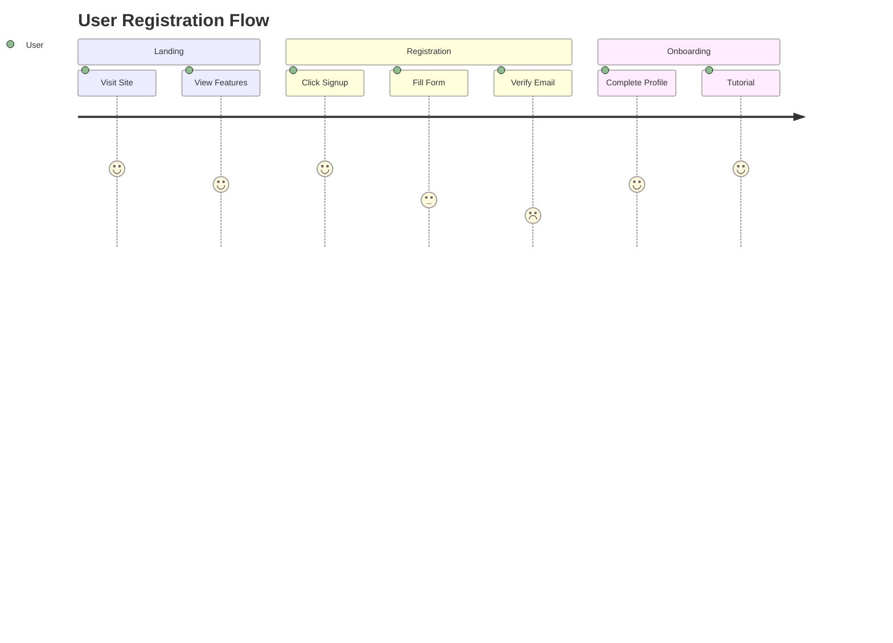
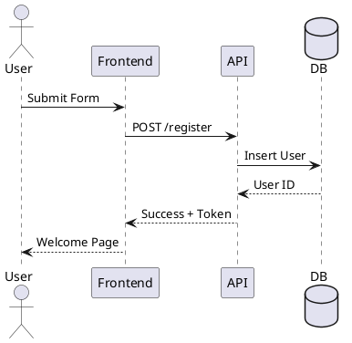

# Canvas + Diagrams: Practical Implementation Guide
## Quick Setup for Enhanced Visual Project Management

### 🎯 Your Goal
Transform Obsidian Canvas from basic blocks to a professional diagramming system for project workflows, supporting:
- Flow diagrams with decision points
- System architecture diagrams
- UML/technical diagrams
- Interactive visual documentation

---

## ⚡ 15-Minute Quick Start

### Step 1: Install Core Plugins (3 min)
```
Obsidian → Settings → Community Plugins → Browse

Install these 3:
1. Advanced Canvas (essential)
2. Excalidraw (recommended)
3. Kroki (for code diagrams)
```

### Step 2: Configure Advanced Canvas (2 min)
```yaml
Settings → Advanced Canvas:
  Enable Flowchart Shapes: ✓
  Enable Custom Styles: ✓
  Enable Presentation Mode: ✓
  Enable Portals: ✓
  Default Node Width: 250
  Default Node Height: 100
  Enable Auto-resize: ✓
```

### Step 3: Create Your First Enhanced Canvas (5 min)

1. Create new canvas: `project-flow.canvas`
2. Right-click canvas → Advanced Canvas menu
3. Add flowchart shapes:
   - **Rectangle**: Tasks
   - **Diamond**: Decisions
   - **Circle**: Start/End points
   - **Hexagon**: External systems

### Step 4: Add Code-Based Diagrams (5 min)

Create `architecture.md`:
```markdown
# System Architecture

\```mermaid
graph TB
    subgraph Frontend
        A[React App]
        B[Redux Store]
    end
    
    subgraph Backend
        C[API Gateway]
        D[Microservices]
        E[(Database)]
    end
    
    A --> B
    B --> C
    C --> D
    D --> E
\```
```

Then drag this note into your canvas!

---

## 🏗️ Architecture Patterns

### Pattern 1: Project Overview Canvas
```
project-dashboard.canvas
├── [Group] Planning Phase
│   ├── requirements.md (embedded)
│   ├── timeline.excalidraw (linked)
│   └── [Diamond] Approval Gate
├── [Group] Development
│   ├── architecture.md (with Mermaid)
│   ├── tasks.md (linked)
│   └── [Hexagon] GitHub Repo
└── [Group] Deployment
    ├── deployment-flow.md (PlantUML)
    └── [Circle] Go-Live
```

### Pattern 2: Nested Canvas Structure
```
Main Canvas (Overview)
├── Portal → Sprint 1 Canvas
├── Portal → Sprint 2 Canvas
└── Portal → Architecture Canvas
    ├── Excalidraw diagram
    ├── Mermaid sequences
    └── PlantUML components
```

---

## 📊 Diagram Type Selection Guide

### When to Use What

| Diagram Type | Best Plugin | Use Case | Example |
|-------------|------------|----------|---------|
| **Quick Flowchart** | Advanced Canvas | Simple workflows | Task dependencies |
| **System Architecture** | Excalidraw | Visual design | Cloud architecture |
| **Sequence Diagram** | Mermaid | API flows | Request/response |
| **UML Class Diagram** | PlantUML | Code structure | Class relationships |
| **Entity Relationship** | Mermaid | Database design | Table relationships |
| **Mind Maps** | Excalidraw/Markmap | Brainstorming | Ideas/concepts |
| **Gantt Charts** | Mermaid | Project timeline | Task scheduling |
| **Network Diagrams** | Draw.io | Infrastructure | Server topology |

---

## 🔥 Power User Workflows

### Workflow 1: SAP Project Documentation
```markdown
# Canvas Structure
Main Project Canvas
├── Phase Diagrams (Advanced Canvas shapes)
├── Technical Architecture (embedded PlantUML)
├── Data Flow (Mermaid in note)
└── Integration Points (Excalidraw)

# PlantUML for SAP Architecture
\```plantuml
@startuml
!define RECTANGLE class

package "SAP S/4HANA" {
  RECTANGLE FI {
    + General Ledger
    + Accounts Payable
    + Accounts Receivable
  }
  
  RECTANGLE CO {
    + Cost Centers
    + Profit Centers
    + Internal Orders
  }
}

package "External Systems" {
  RECTANGLE CRM
  RECTANGLE WMS
}

FI --> CRM : Customer Data
CO --> WMS : Cost Allocation
@enduml
\```
```

### Workflow 2: Web Development Sprint
```javascript
// Canvas with embedded diagrams

// 1. User Flow (Mermaid)


// 2. Component Architecture (Excalidraw)
// Visual component tree with interactions

// 3. API Sequence (PlantUML)

```

---

## 🎨 Styling & Theming

### Advanced Canvas Node Styles
```css
/* Custom CSS for nodes */
.canvas-node-content {
    /* Flowchart shapes automatically applied */
}

/* Decision diamonds */
.shape-diamond {
    background: #ffe6e6;
    border-color: #ff4444;
}

/* Process rectangles */
.shape-rectangle {
    background: #e6f3ff;
    border-color: #0066cc;
}

/* External systems */
.shape-hexagon {
    background: #fff0e6;
    border-color: #ff8800;
}
```

### Mermaid Theme Configuration
```javascript
%%{init: {
  "theme": "default",
  "themeVariables": {
    "primaryColor": "#ff0000",
    "primaryTextColor": "#fff",
    "primaryBorderColor": "#7C0000",
    "lineColor": "#F8B229",
    "secondaryColor": "#006100",
    "tertiaryColor": "#fff"
  }
}}%%
```

---

## 🔌 Integration Examples

### Example 1: Canvas + Tasks
```markdown
# In your canvas, create a decision node:
[Diamond: "Bug Critical?"]
  ├─Yes→ [Link to: critical-bug-task.md]
  └─No→ [Link to: backlog-task.md]

# critical-bug-task.md
---
type: task
priority: high
status: todo
---
## Fix Critical Bug
- [ ] Identify root cause
- [ ] Implement fix
- [ ] Test thoroughly
```

### Example 2: Excalidraw + Canvas
```javascript
// 1. Create diagram in Excalidraw
// 2. Save as architecture.excalidraw
// 3. In canvas, embed the file
// 4. Updates in Excalidraw reflect in canvas

// Excalidraw embedding options:
{
  "width": 800,
  "height": 600,
  "theme": "light",
  "viewMode": "view", // or "zen"
  "zenMode": false
}
```

### Example 3: Dynamic Diagrams with Kroki
```markdown
# API Endpoints (updates automatically)
\```kroki type=plantuml
@startuml
!define ENDPOINT(name,desc) class name <<endpoint>> {
  desc
}

package "API v1" {
  ENDPOINT(GET /users, "List all users")
  ENDPOINT(POST /users, "Create user")
  ENDPOINT(GET /users/id, "Get user by ID")
  ENDPOINT(PUT /users/id, "Update user")
  ENDPOINT(DELETE /users/id, "Delete user")
}
@enduml
\```
```

---

## 📋 Templates

### Project Canvas Template
Save as `templates/project-canvas-template.json`:
```json
{
  "nodes": [
    {
      "type": "group",
      "label": "Planning",
      "x": 0,
      "y": 0,
      "width": 400,
      "height": 300
    },
    {
      "type": "group",
      "label": "Development",
      "x": 500,
      "y": 0,
      "width": 400,
      "height": 300
    },
    {
      "type": "group",
      "label": "Testing",
      "x": 1000,
      "y": 0,
      "width": 400,
      "height": 300
    },
    {
      "type": "text",
      "text": "Start",
      "shape": "circle",
      "x": 50,
      "y": 100
    },
    {
      "type": "text",
      "text": "Requirements Complete?",
      "shape": "diamond",
      "x": 200,
      "y": 100
    }
  ],
  "edges": []
}
```

### Mermaid Templates Library
Create `templates/diagrams.md`:
```markdown
# Diagram Templates

## Flowchart
\```mermaid
flowchart TD
    Start([Start])
    Input[/Input data/]
    Process[Process]
    Decision{Decision}
    Output[/Output/]
    End([End])
    
    Start --> Input
    Input --> Process
    Process --> Decision
    Decision -->|Yes| Output
    Decision -->|No| Process
    Output --> End
\```

## Sequence
\```mermaid
sequenceDiagram
    participant C as Client
    participant S as Server
    participant D as Database
    
    C->>S: Request
    S->>D: Query
    D-->>S: Result
    S-->>C: Response
\```

## State
\```mermaid
stateDiagram-v2
    [*] --> Idle
    Idle --> Processing : Start
    Processing --> Success : Complete
    Processing --> Error : Fail
    Success --> [*]
    Error --> Idle : Retry
\```
```

---

## 🚨 Troubleshooting

### Issue: Mermaid not rendering
```bash
# Solution: Enable in settings
Settings → Editor → Show Mermaid diagrams
```

### Issue: Advanced Canvas shapes not showing
```bash
# Solution: Refresh canvas
Cmd/Ctrl + R in canvas view
# Or restart Obsidian
```

### Issue: Excalidraw performance
```bash
# Solution: Optimize settings
Excalidraw Settings:
- Disable autosave
- Reduce image quality
- Use compression
```

---

## 🎯 Best Practices

1. **Start Simple**: Use Advanced Canvas for 80% of diagrams
2. **Code for Complex**: Mermaid/PlantUML for technical diagrams
3. **Visual for Creative**: Excalidraw for brainstorming
4. **Version Control**: Code-based diagrams in Git
5. **Performance**: Don't embed huge diagrams, link instead
6. **Consistency**: Use templates for similar diagrams
7. **Navigation**: Use portals for multi-level canvases

---

## 📚 Learning Path

### Week 1: Basics
- Day 1: Advanced Canvas shapes
- Day 2: Basic Mermaid flowcharts
- Day 3: First Excalidraw diagram
- Day 4: Embed diagrams in canvas
- Day 5: Create project template

### Week 2: Advanced
- Day 1: PlantUML for UML
- Day 2: Kroki for multiple types
- Day 3: Canvas portals
- Day 4: Custom styling
- Day 5: Integration with tasks

---

## 🎉 You're Ready!

With this setup, your canvas can now handle:
- ✅ Professional flowcharts
- ✅ Technical architecture diagrams
- ✅ UML and sequence diagrams
- ✅ Interactive visual documentation
- ✅ Nested diagram hierarchies
- ✅ Code-generated diagrams
- ✅ Hand-drawn sketches

Start with Advanced Canvas + Mermaid, then expand based on needs!
