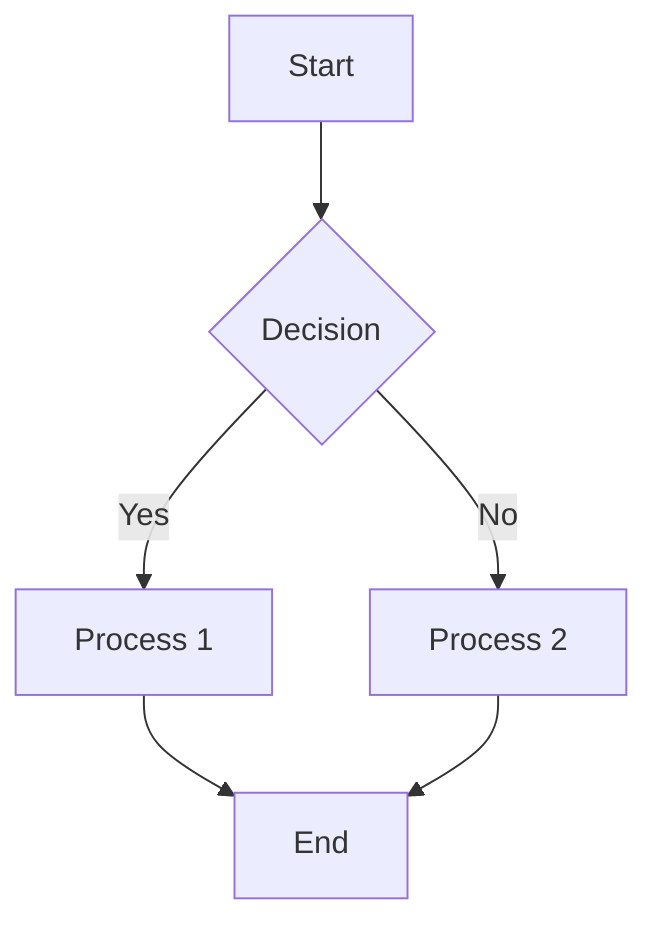
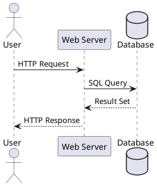
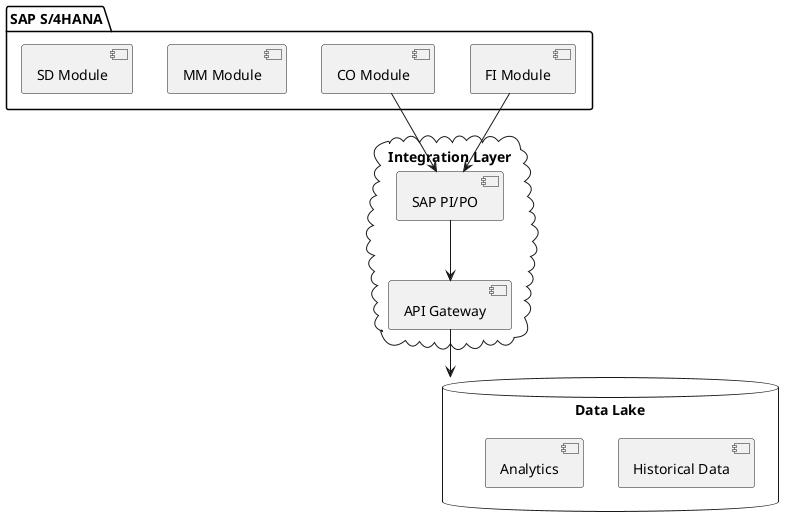
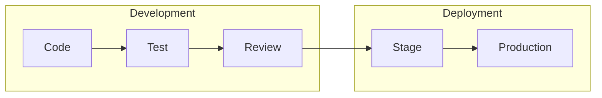
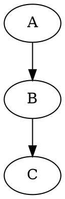

# Obsidian Canvas & Diagramming Plugins Research
## Advanced Flow Diagrams & Block Diagrams Beyond Basic Canvas

### Executive Summary
While Obsidian Canvas provides basic blocks, images, and note embeds, numerous plugins can transform it into a powerful diagramming platform supporting flowcharts, UML diagrams, mindmaps, and technical architecture diagrams. This research identifies 15+ plugins that extend canvas functionality with professional diagramming capabilities.

---

## 🎨 Canvas Limitations & Solutions

### Native Canvas Capabilities
- **Text blocks** (colored rectangles)
- **Note embeds** (linked .md files)
- **Image embeds** (PNG, JPG)
- **Arrows/edges** (connections between nodes)
- **Groups** (visual containers)

### What's Missing
- ❌ Advanced shapes (diamonds, circles, hexagons)
- ❌ Auto-layout algorithms
- ❌ Code-based diagram generation
- ❌ Professional diagram types (UML, BPMN, etc.)
- ❌ SVG export with interactive elements

---

## 🚀 Essential Diagramming Plugins

### 1. **Advanced Canvas** ⭐ GAME-CHANGER
This plugin enhances the canvas experience with flowchart shapes, border styles, text alignment, collapsible groups, portals for embedding canvases, auto-resizing nodes, focus mode, and presentation mode.

**Key Features:**
- **Flowchart Shapes**: Diamonds, circles, hexagons, parallelograms
- **Node Styles**: Custom colors, borders, shadows
- **Portals**: Embed canvas within canvas
- **Presentation Mode**: Turn canvas into slides
- **Auto-layout**: Automatic node arrangement
- **Export**: PNG/SVG with transparency
- **Groups**: Collapsible sections
- **Focus Mode**: Highlight single nodes

**Use Cases:**
- Complex flowcharts
- System architecture diagrams
- Interactive presentations
- Nested diagrams

---

### 2. **Excalidraw** ⭐ MOST POWERFUL
Excalidraw integrates sketching directly into Obsidian with LaTeX support, markdown embedding, and a script engine for automation. It supports linking between drawings and notes.

**Features:**
- Hand-drawn style diagrams
- Infinite canvas
- Shape libraries
- LaTeX formula support
- Script automation
- SVG/PNG export
- Collaborative editing
- Template system

**Diagram Types:**
- Flowcharts
- Architecture diagrams
- Wireframes
- Mind maps
- Free-form sketches

---

### 3. **Mermaid (Native Support)**
Obsidian has built-in Mermaid support for code-based diagrams.



**Supported Diagrams:**
- Flowcharts
- Sequence diagrams
- Gantt charts
- Class diagrams
- State diagrams
- Git graphs
- Entity relationship diagrams

---

### 4. **Kroki** ⭐ VERSATILE
The Kroki plugin allows rendering various diagram types including sequence diagrams, flowcharts using a Kroki server. Create fenced code blocks with diagram type as language and add your code inside.

**Supports 20+ Diagram Types:**
- PlantUML
- GraphViz
- BlockDiag
- C4 diagrams
- BPMN
- Excalidraw
- D2
- Nomnoml
- WaveDrom (timing diagrams)
- Pikchr

**Example:**


---

### 5. **Diagrams.net (Draw.io)** ⭐ PROFESSIONAL
Create and insert diagrams directly into notes or save as standalone files. Supports SVG files and .drawio extensions with intuitive interfaces for editing.

**Features:**
- Professional diagram editor
- Extensive shape libraries
- UML, BPMN, flowcharts
- Network diagrams
- Circuit diagrams
- Database schemas
- SVG export
- Clickable elements

---

### 6. **PlantUML Plugin**
Render PlantUML diagrams directly within notes using either online PlantUML server or local .jar file, with support for linking to other notes in the vault.

**Diagram Types:**
- UML diagrams (all types)
- Component diagrams
- Deployment diagrams
- Use case diagrams
- Activity diagrams
- ASCII art diagrams

---

### 7. **D2 Plugin**
Modern diagram scripting language for technical diagrams.

**Features:**
- Clean, minimalist style
- Auto-layout
- Multiple themes
- Sketch mode
- Various layout engines

**Example:**
```d2
direction: right
shape: sequence_diagram

alice -> bob: Hello
bob -> alice: Hi!
```

---

### 8. **Canvas-Specific Enhancements**

#### **Canvas Mindmap**
Adds mind mapping functionality to Canvas view with convenient commands to quickly add cards and navigate using keyboard, plus auto layout for organized view.

#### **Canvas Links**
Automatically creates edges between notes based on their links.

#### **Canvas Filter**
Show/hide nodes based on tags or properties.

#### **Canvas Presentation**
Convert canvas to presentation slides.

---

## 📊 Plugin Comparison Matrix

| Plugin | Canvas Integration | Code-Based | Visual Editor | Export Options | Learning Curve |
|--------|-------------------|------------|---------------|----------------|----------------|
| **Advanced Canvas** | Native | ❌ | ✅ | PNG/SVG | Low |
| **Excalidraw** | Separate | Partial | ✅ | SVG/PNG | Medium |
| **Mermaid** | Embed | ✅ | ❌ | SVG | Medium |
| **Kroki** | Embed | ✅ | ❌ | Multiple | High |
| **Draw.io** | Embed | ❌ | ✅ | SVG/PNG | Low |
| **PlantUML** | Embed | ✅ | ❌ | PNG/SVG | High |
| **D2** | Embed | ✅ | ❌ | SVG | Medium |

---

## 🔧 Integration Strategies

### Strategy 1: Canvas + Advanced Canvas (Simplest)
```
1. Install Advanced Canvas plugin
2. Use enhanced shapes and styles
3. Create flowcharts directly in canvas
4. Export as SVG with interactivity
```

### Strategy 2: Canvas + Excalidraw (Most Flexible)
```
1. Create diagrams in Excalidraw
2. Export as SVG
3. Embed SVG in canvas nodes
4. Link excalidraw files to canvas
```

### Strategy 3: Canvas + Code Diagrams (Automated)
```
1. Write Mermaid/PlantUML in notes
2. Embed notes in canvas
3. Diagrams render automatically
4. Version control friendly
```

### Strategy 4: Hybrid Approach (Recommended)
```
1. Advanced Canvas for main structure
2. Excalidraw for complex visuals
3. Mermaid for process flows
4. PlantUML for technical diagrams
```

---

## 🎯 Use Case Recommendations

### For SAP Implementation Diagrams
**Best Combo**: PlantUML + Canvas


### For Web Development Architecture
**Best Combo**: Excalidraw + Advanced Canvas
- Excalidraw for system architecture
- Advanced Canvas for user flows
- Mermaid for sequence diagrams

### For Project Management
**Best Combo**: Advanced Canvas + Canvas Mindmap
- Visual project phases
- Auto-layout for tasks
- Collapsible groups for sprints

---

## 💡 Advanced Features

### 1. **ExcaliBrain** - Visual Knowledge Graph
Generates an interactive, structured mind-map of your vault based on folders, files, links, dataview fields, tags and YAML frontmatter, inspired by TheBrain and Breadcrumbs.

**Benefits:**
- Automatic relationship mapping
- 5 relationship types (parent, child, friend, sibling)
- Interactive navigation
- Integrates with existing notes

### 2. **Markmap Integration**
View Markdown notes as Mind Maps using Markmap with preview updating as you select other panes, similar to Local Graph, Outline and Backlink panes.

**Features:**
- Auto-generate from markdown
- Collapsible branches
- Export as SVG
- Real-time updates

### 3. **Canvas to SVG Export**
Some users have created scripts to convert canvas JSON to SVG:
- Preserves node positions
- Maintains connections
- Clickable elements
- Custom styling

---

## 🚀 Implementation Guide

### Phase 1: Basic Setup (Day 1)
```
1. Install Advanced Canvas
2. Experiment with flowchart shapes
3. Create simple diagram
4. Test export options
```

### Phase 2: Code Diagrams (Day 2-3)
```
1. Learn Mermaid syntax
2. Install Kroki for PlantUML
3. Create technical diagrams
4. Embed in canvas
```

### Phase 3: Visual Tools (Day 4-5)
```
1. Install Excalidraw
2. Import shape libraries
3. Create architecture diagram
4. Link to canvas nodes
```

### Phase 4: Integration (Week 2)
```
1. Combine approaches
2. Create templates
3. Establish workflow
4. Document best practices
```

---

## 📝 Practical Examples

### Example 1: Task Flow in Canvas
```javascript
// Using Advanced Canvas shapes
Node Types:
- Rectangle: Normal task
- Diamond: Decision point
- Circle: Start/End
- Hexagon: External system
- Parallelogram: Input/Output

Colors:
- Green: Completed
- Yellow: In Progress
- Red: Blocked
- Blue: Information
```

### Example 2: Embedded Mermaid in Canvas
Create note `workflow.md`:
```markdown

```
Then embed this note in canvas.

### Example 3: Kroki Multi-Diagram
```yaml
# In one note, multiple diagram types
```plantuml
[Component Diagram]
```



```d2
shape: sequence_diagram
```
```

---

## 🔗 Resources & Links

### Plugin Documentation
- [Advanced Canvas GitHub](https://github.com/Developer-Mike/obsidian-advanced-canvas)
- [Excalidraw Plugin](https://github.com/zsviczian/obsidian-excalidraw-plugin)
- [Kroki Documentation](https://kroki.io/examples.html)
- [Mermaid Live Editor](https://mermaid.live/)
- [PlantUML Reference](https://plantuml.com/)

### Tutorials
- [Excalidraw in Obsidian Tutorial](https://www.youtube.com/results?search_query=excalidraw+obsidian)
- [Mermaid Diagram Guide](https://mermaid-js.github.io/mermaid/)
- [Canvas Workflow Examples](https://forum.obsidian.md/tag/canvas)

---

## 🎉 Conclusion

Obsidian Canvas can be transformed from basic blocks to a professional diagramming platform through plugins:

1. **Advanced Canvas** alone adds 80% of needed features
2. **Excalidraw** provides infinite flexibility
3. **Code-based diagrams** (Mermaid, PlantUML) offer version control
4. **Specialized plugins** cover specific needs

**Recommended Stack for Rohit:**
1. **Advanced Canvas** - Core enhancement
2. **Excalidraw** - Visual design
3. **Mermaid** - Process flows
4. **PlantUML** - Technical diagrams

This combination covers all diagramming needs while maintaining compatibility with your GitHub workflow and task management system!
