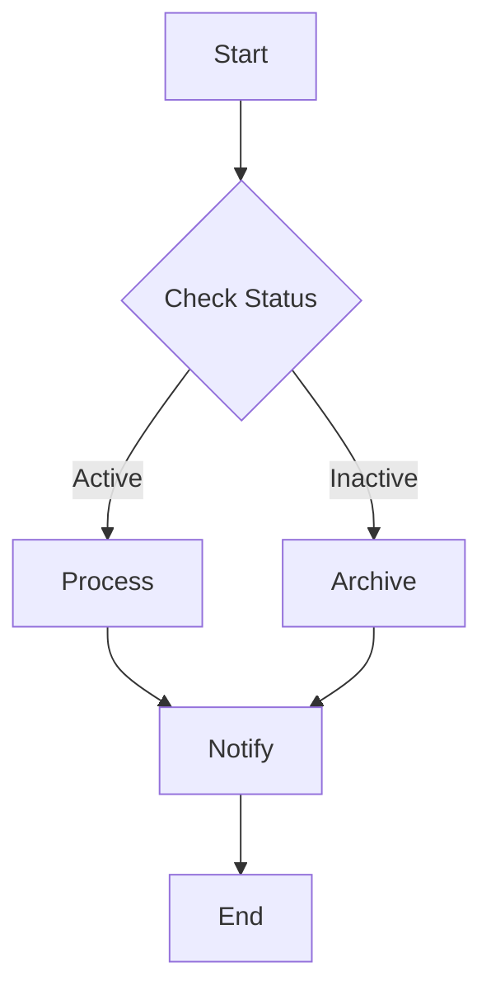
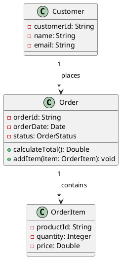
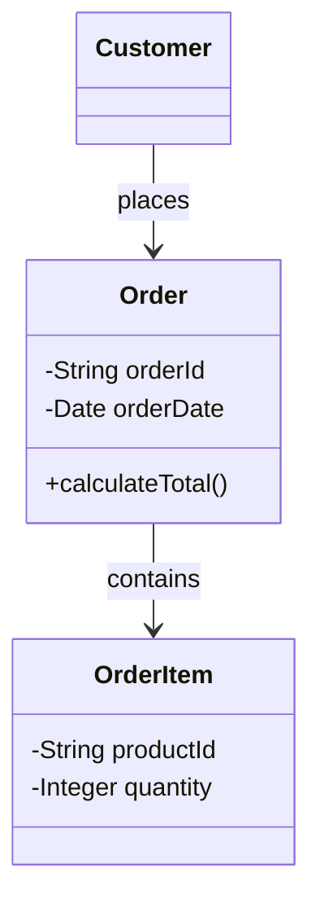
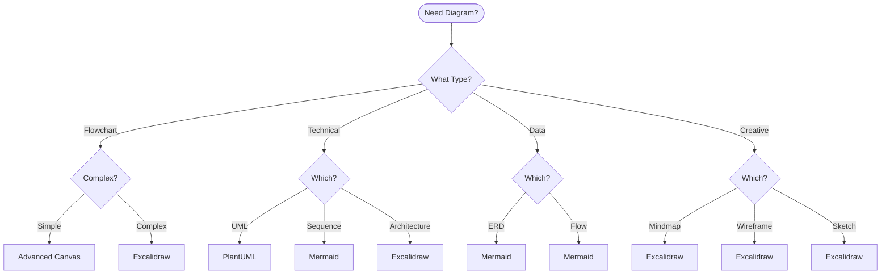
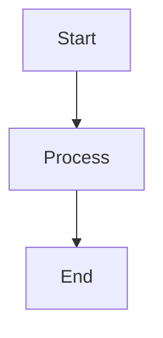
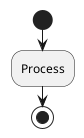

# Visual Guide: Diagram Types & Best Plugins
## Quick Reference for Choosing the Right Tool

---

## 📊 Diagram Type Matrix

| Diagram Type | Best Plugin | Runner-Up | Code/Visual | Difficulty | Export |
|-------------|------------|-----------|-------------|------------|---------|
| **Simple Flowchart** | Advanced Canvas | Mermaid | Visual | ⭐ | PNG/SVG |
| **Complex Flowchart** | Excalidraw | Draw.io | Visual | ⭐⭐ | SVG/PNG |
| **UML Class Diagram** | PlantUML | Mermaid | Code | ⭐⭐⭐ | SVG |
| **Sequence Diagram** | Mermaid | PlantUML | Code | ⭐⭐ | SVG |
| **Entity Relationship** | Mermaid | PlantUML | Code | ⭐⭐ | SVG |
| **Mind Map** | Excalidraw | Markmap | Both | ⭐ | SVG |
| **System Architecture** | Excalidraw | Draw.io | Visual | ⭐⭐ | SVG/PNG |
| **Network Diagram** | Draw.io | Excalidraw | Visual | ⭐⭐ | SVG |
| **BPMN Process** | Draw.io | Kroki+BPMN | Both | ⭐⭐⭐ | SVG |
| **Gantt Chart** | Mermaid | PlantUML | Code | ⭐ | SVG |
| **State Diagram** | Mermaid | PlantUML | Code | ⭐⭐ | SVG |
| **Component Diagram** | PlantUML | C4-PlantUML | Code | ⭐⭐⭐ | SVG |
| **Wireframes** | Excalidraw | Draw.io | Visual | ⭐ | PNG |
| **Data Flow** | Mermaid | Advanced Canvas | Both | ⭐⭐ | SVG |
| **Circuit Diagram** | Circuit Sketcher | Draw.io | Visual | ⭐⭐⭐ | SVG |

---

## 🎨 Visual Examples Gallery

### 1. Flowchart Comparison

#### Advanced Canvas (Visual)
```
Features:
✅ Drag-and-drop
✅ Pre-built shapes
✅ Quick styling
✅ Canvas integration
❌ No auto-layout
```

#### Mermaid (Code)

```
Features:
✅ Auto-layout
✅ Version control
✅ Quick to write
❌ Limited styling
```

---

### 2. System Architecture Comparison

#### Excalidraw (Best for Architecture)
```
Strengths:
- Free-form drawing
- Custom shapes
- Hand-drawn style
- Image embedding
- Infinite canvas
- Libraries of components
```

#### PlantUML C4 (Code-based)
```plantuml
@startuml
!include https://raw.githubusercontent.com/plantuml-stdlib/C4-PlantUML/master/C4_Container.puml

Person(user, "User", "End user of the system")
System_Boundary(boundary, "System") {
    Container(web, "Web App", "React", "Frontend")
    Container(api, "API", "Node.js", "Backend")
    ContainerDb(db, "Database", "PostgreSQL", "Storage")
}

Rel(user, web, "Uses", "HTTPS")
Rel(web, api, "Calls", "REST/JSON")
Rel(api, db, "Reads/Writes", "SQL")
@enduml
```

---

### 3. UML Diagrams

#### PlantUML (Best for UML)


#### Mermaid (Simpler Alternative)


---

## 🔄 Decision Flow



---

## 🛠️ Plugin Capabilities

### Advanced Canvas
```yaml
Shapes:
  - Rectangle (default)
  - Diamond (decision)
  - Circle (start/end)
  - Hexagon (external)
  - Parallelogram (I/O)
  - Custom CSS shapes

Features:
  - Native to Obsidian
  - Instant preview
  - Node linking
  - Group/Portal support
  - Presentation mode
  
Best For:
  - Quick diagrams
  - Project overviews
  - Visual navigation
```

### Excalidraw
```yaml
Tools:
  - Selection
  - Rectangle/Square
  - Diamond/Circle
  - Arrow/Line
  - Text
  - Image
  - Free drawing

Libraries:
  - Software Architecture
  - AWS/Azure/GCP
  - UML Components
  - Wireframe Elements
  - Flow Chart Shapes
  - Mind Map Elements

Best For:
  - Architecture diagrams
  - Brainstorming
  - Wireframes
  - Creative diagrams
```

### Mermaid
```yaml
Diagram Types:
  - flowchart (TB/TD/LR/RL)
  - sequenceDiagram
  - classDiagram
  - stateDiagram-v2
  - erDiagram
  - gantt
  - pie
  - journey
  - gitGraph
  - mindmap

Best For:
  - Quick documentation
  - Version control
  - Auto-layout needs
  - Standard diagrams
```

### PlantUML
```yaml
Diagram Types:
  - Class
  - Sequence
  - Use Case
  - Activity
  - Component
  - State
  - Deployment
  - Object
  - Package
  - Timing

Extensions:
  - C4 Model
  - AWS/Azure Icons
  - Office Icons
  - Kubernetes

Best For:
  - Professional UML
  - Enterprise docs
  - Technical specs
```

---

## 📈 Performance Comparison

| Plugin | Load Time | Canvas Impact | File Size | Memory Usage |
|--------|-----------|---------------|-----------|--------------|
| **Advanced Canvas** | Instant | None | Small | Low |
| **Mermaid** | Fast | Low | Tiny | Low |
| **PlantUML** | Medium | Medium | Tiny | Medium |
| **Excalidraw** | Slow | High | Large | High |
| **Draw.io** | Slow | High | Medium | High |
| **Kroki** | Variable | Low | Tiny | Low |

---

## 🎯 Use Case Recommendations

### For Rohit's Projects

#### SAP Documentation
```
Primary: PlantUML
- Component diagrams
- Deployment diagrams
- Process flows

Secondary: Mermaid
- Quick sequences
- Data flows

Visual: Draw.io
- Network topology
- System landscape
```

#### Web Development
```
Primary: Excalidraw
- Architecture
- Wireframes
- User flows

Secondary: Mermaid
- API sequences
- State machines

Quick: Advanced Canvas
- Sprint planning
- Task flows
```

#### Task Management
```
Primary: Advanced Canvas
- Task dependencies
- Sprint overview
- Decision trees

Secondary: Mermaid
- Gantt charts
- Process flows
```

---

## 🚀 Quick Start Commands

### Create Mermaid Diagram
````markdown

````

### Create PlantUML Diagram
````markdown

````

### Create Kroki Diagram
````markdown
```kroki type=graphviz
digraph G {
    A -> B;
    B -> C;
}
```
````

### Advanced Canvas Shape
```
Right-click → Change Shape → [Diamond/Circle/Hexagon]
```

### Excalidraw Quick Start
```
Create file: diagram.excalidraw
Open → Start drawing
```

---

## 💡 Pro Tips

1. **Start with Mermaid** for documentation
2. **Use Excalidraw** for presentations
3. **PlantUML** for technical specs
4. **Advanced Canvas** for navigation
5. **Mix approaches** for best results

---

## 📋 Installation Priority

### Essential (Install First)
1. **Advanced Canvas** - Enhances native canvas
2. **Mermaid** - Built-in, just use it

### Recommended (Install Second)
3. **Excalidraw** - Visual flexibility
4. **PlantUML** - Technical diagrams

### Optional (As Needed)
5. **Kroki** - Multiple diagram types
6. **Draw.io** - Professional shapes
7. **Markmap** - Mind mapping
8. **D2** - Modern diagrams

---

## 🎉 Summary

**For Quick Diagrams**: Advanced Canvas + Mermaid
**For Visual Work**: Excalidraw
**For Technical Docs**: PlantUML
**For Everything Else**: Combination approach

Choose based on:
- **Speed needed** (Canvas/Mermaid fastest)
- **Visual quality** (Excalidraw/Draw.io best)
- **Version control** (Code-based best)
- **Complexity** (PlantUML most capable)
