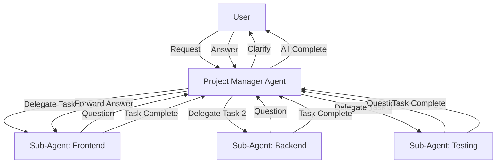
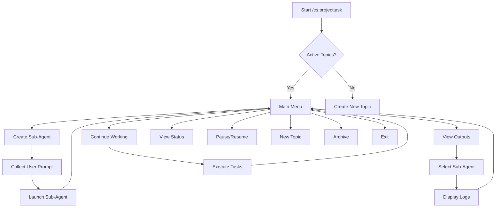

# TASK: Hierarchical Multi-Agent Orchestration System

**Status**: ✅ MVP COMPLETE (2025-10-22)
**Priority**: High
**Created**: 2025-10-22
**Completed**: 2025-10-22
**Type**: Architecture / Framework Enhancement
**Implementation**: See `IMPLEMENTATION-SUMMARY.md` for details

## Overview

Build a hierarchical multi-agent orchestration system where a Project Manager (PM) agent coordinates multiple specialist sub-agents. Sub-agents work independently but report to PM, ask PM for clarifications (not user directly), and communicate via file-based state management.

**🆕 Updated Design (2025-10-22)**:
- ✅ **Template-Based Architecture**: No predefined sub-agents - single universal template combined with user prompts
- ✅ **Interactive Menu System**: Menu-driven workflow using AskUserQuestion for creating agents and viewing progress
- ✅ **Sub-Agent Output Viewing**: Users can "switch" to view any sub-agent's detailed logs and progress
- ✅ **Enhanced State Files**: Sub-agents write detailed logs for full transparency
- ✅ **Topic-Based Organization**: Each project task managed as a resumable topic

## Architecture Vision



## Core Principles

1. **Single Point of Contact**: User only interacts with PM agent
2. **Hierarchical Communication**: Sub-agents → PM → User (never Sub-agent → User)
3. **File-Based State**: Agents communicate via JSON state files
4. **Parallel Execution**: PM launches independent tasks in parallel
5. **Autonomous Sub-Agents**: Execute tasks independently, ask PM when blocked
6. **Transparent Progress**: User sees TodoWrite tracking from PM

## Technical Design

### Components

#### 1. PM Agent (`.claude/agents/pm-orchestrator.md`)

**Responsibilities**:
- Parse user request into discrete tasks
- Assign tasks to specialist agents based on capabilities
- Launch agents in parallel when tasks are independent
- Monitor agent progress via state files
- Handle sub-agent questions (answer or escalate to user)
- Aggregate results and report to user
- Maintain TodoWrite list for user visibility

**Capabilities**:
- Task decomposition and dependency analysis
- Agent capability matching
- State file management
- Question routing logic
- Progress aggregation

#### 2. Sub-Agent Template (`.claude/agents/sub-agent-template.md`)

**Behavior Rules**:
- Read task assignment from state file
- Execute task independently using specialist knowledge
- Write questions to state file when blocked (NEVER ask user directly)
- Poll state file for PM answers
- Write completion status with results
- Report errors/failures to PM
- Maintain sub-task TodoWrite for internal tracking

**Communication Protocol**:
- Read: `state/task-{id}-{agent}.json` for task details and answers
- Write: Questions, progress updates, completion status
- Never: Direct user interaction, cross-agent communication

#### 3. State Management Skill (`.claude/skills/agent-orchestration/`)

**File Structure**:
```
.claude/agents/state/
├── pm-state.json          # PM's task queue and orchestration state
├── task-001-frontend.json # Sub-agent 1 state
├── task-002-backend.json  # Sub-agent 2 state
├── task-003-testing.json  # Sub-agent 3 state
└── messages.json          # Inter-agent message queue
```

**Utilities**:
- `orchestrator.sh` - PM orchestration logic
- `state-manager.sh` - State file CRUD operations
- `message-router.sh` - Inter-agent messaging
- `task-assigner.sh` - Intelligent task routing

#### 4. Communication Hook (`.claude/hooks/agent-communication.sh`)

**Purpose**:
- Watch for sub-agent state changes
- Notify PM when questions are written
- Trigger PM response flow
- (Optional: Event-driven alternative to polling)

### State File Schemas

#### PM State (`pm-state.json`)

```json
{
  "sessionId": "sess_20251022_100000",
  "userRequest": "Add authentication system with JWT",
  "tasks": [
    {
      "id": "task_001",
      "description": "Design and implement database schema for users and auth tokens",
      "assignedTo": "backend-architect",
      "status": "in_progress",
      "dependencies": [],
      "startTime": "2025-10-22T10:00:00Z",
      "estimatedDuration": "30min"
    },
    {
      "id": "task_002",
      "description": "Build JWT authentication API endpoints",
      "assignedTo": "backend-architect",
      "status": "pending",
      "dependencies": ["task_001"],
      "startTime": null,
      "estimatedDuration": "45min"
    },
    {
      "id": "task_003",
      "description": "Create login UI components with form validation",
      "assignedTo": "frontend-architect",
      "status": "in_progress",
      "dependencies": [],
      "startTime": "2025-10-22T10:00:00Z",
      "estimatedDuration": "40min"
    }
  ],
  "messageQueue": ["msg_001", "msg_002"],
  "overallStatus": "in_progress",
  "completedTasks": 0,
  "totalTasks": 3
}
```

#### Sub-Agent State (`task-001-backend.json`)

```json
{
  "taskId": "task_001",
  "agentType": "backend-architect",
  "status": "blocked",
  "assignedAt": "2025-10-22T10:00:00Z",
  "startedAt": "2025-10-22T10:00:30Z",
  "blockingQuestion": {
    "id": "q_001",
    "question": "Should we use UUID or auto-increment for user IDs? Consider scalability and distributed systems.",
    "context": "Designing users table schema. Project may scale to multiple databases.",
    "timestamp": "2025-10-22T10:05:00Z",
    "answered": false,
    "answer": null
  },
  "progress": {
    "completed": ["analyze_requirements", "review_existing_schema"],
    "current": "design_users_table",
    "remaining": ["create_migration", "add_indexes", "testing"]
  },
  "todos": [
    {"task": "Analyze auth requirements", "status": "completed"},
    {"task": "Design users table", "status": "in_progress"},
    {"task": "Design tokens table", "status": "pending"},
    {"task": "Create migrations", "status": "pending"}
  ],
  "filesModified": [],
  "filesCreated": [],
  "errors": []
}
```

#### Message Queue (`messages.json`)

```json
[
  {
    "id": "msg_001",
    "type": "question",
    "from": "backend-architect",
    "to": "pm-orchestrator",
    "taskId": "task_001",
    "timestamp": "2025-10-22T10:05:00Z",
    "content": "Should we use UUID or auto-increment for user IDs?",
    "status": "pending",
    "response": null
  },
  {
    "id": "msg_002",
    "type": "completion",
    "from": "frontend-architect",
    "to": "pm-orchestrator",
    "taskId": "task_003",
    "timestamp": "2025-10-22T10:35:00Z",
    "content": "Login UI completed with form validation",
    "status": "acknowledged"
  }
]
```

### Communication Protocols

#### Sub-Agent → PM (Question Flow)

```bash
# 1. Sub-agent writes question to state file
jq '.blockingQuestion = {
  "id": "q_001",
  "question": "Use UUID or auto-increment?",
  "timestamp": "'$(date -Iseconds)'",
  "answered": false
} | .status = "blocked"' state/task-001-backend.json > tmp && mv tmp state/task-001-backend.json

# 2. Sub-agent adds message to queue
jq '. += [{
  "id": "msg_001",
  "type": "question",
  "from": "backend-architect",
  "to": "pm-orchestrator",
  "taskId": "task_001",
  "content": "Use UUID or auto-increment?",
  "status": "pending"
}]' state/messages.json > tmp && mv tmp state/messages.json

# 3. Sub-agent polls for answer
while [ "$(jq '.blockingQuestion.answered' state/task-001-backend.json)" != "true" ]; do
  sleep 5
done

# 4. Sub-agent reads answer and continues
ANSWER=$(jq -r '.blockingQuestion.answer' state/task-001-backend.json)
# Continue with implementation...
```

#### PM → Sub-Agent (Answer Flow)

```bash
# 1. PM reads pending questions
jq '.[] | select(.type=="question" and .status=="pending")' state/messages.json

# 2. PM decides: answer directly or ask user
# If PM can answer:
jq '.blockingQuestion.answered = true |
    .blockingQuestion.answer = "Use UUID for scalability" |
    .status = "in_progress"' \
  state/task-001-backend.json > tmp && mv tmp state/task-001-backend.json

# If PM needs user input:
# (Use AskUserQuestion tool → get user response → write to state)

# 3. PM updates message queue
jq '(.[] | select(.id=="msg_001")).status = "answered" |
    (.[] | select(.id=="msg_001")).response = "Use UUID"' \
  state/messages.json > tmp && mv tmp state/messages.json
```

#### PM → User (Progress Updates)

```bash
# PM reads all task states
for task in state/task-*.json; do
  status=$(jq -r '.status' "$task")
  progress=$(jq -r '.progress | "\(.completed | length)/\((.completed + .remaining) | length)"' "$task")
  echo "Task $(basename $task): $status ($progress)"
done

# PM uses TodoWrite to show user progress
TodoWrite([
  {"content": "Setup DB schema", "status": "in_progress", "activeForm": "Designing schema"},
  {"content": "Create API endpoints", "status": "pending", "activeForm": "Creating endpoints"},
  {"content": "Build login UI", "status": "completed", "activeForm": "Building UI"}
])
```

## Implementation Phases

### Phase 1: MVP - Basic Orchestration

**Goal**: PM coordinates 2-3 sub-agents with file-based state and manual task assignment.

**Components**:
1. PM agent with basic task decomposition
2. Sub-agent template with question/answer protocol
3. State file structure and utilities
4. Simple polling-based communication

**Success Criteria**:
- PM launches 2 agents in parallel
- Sub-agents ask PM questions (not user)
- PM forwards questions to user
- PM aggregates and reports results

**Timeline**: 1-2 days

### Phase 2: Intermediate - Auto-Routing + Parallel Execution

**Goal**: PM intelligently routes tasks and optimizes parallel execution.

**Components**:
1. Agent capabilities matrix
2. Intelligent task-to-agent matching
3. Dependency analysis for parallel execution
4. Progress monitoring and reporting

**Success Criteria**:
- PM auto-assigns tasks based on agent expertise
- PM launches 5+ agents in parallel
- PM handles task dependencies correctly
- User sees real-time progress via TodoWrite

**Timeline**: 3-4 days

### Phase 3: Advanced - Full Orchestration Framework

**Goal**: Production-ready orchestration with error handling, rollback, and optimization.

**Components**:
1. Error handling and retry logic
2. State rollback on failures
3. PM autonomous decision-making
4. Performance metrics and optimization
5. Hook-based event system (optional)

**Success Criteria**:
- PM handles agent failures gracefully
- PM can rollback partial work on errors
- PM answers 70%+ of questions autonomously
- System tracks performance metrics
- Full audit trail of all decisions

**Timeline**: 5-7 days

## Agent Capabilities Matrix

```json
{
  "agents": {
    "frontend-architect": {
      "expertise": ["react", "typescript", "ui", "components", "state-management"],
      "tools": ["Read", "Edit", "Write", "Glob", "Grep"],
      "maxParallelTasks": 3
    },
    "backend-architect": {
      "expertise": ["laravel", "php", "api", "database", "architecture"],
      "tools": ["Read", "Edit", "Write", "Bash", "Glob", "Grep"],
      "maxParallelTasks": 3
    },
    "security-engineer": {
      "expertise": ["vulnerabilities", "auth", "encryption", "audit", "compliance"],
      "tools": ["Read", "Grep", "Bash"],
      "maxParallelTasks": 2
    },
    "performance-engineer": {
      "expertise": ["optimization", "caching", "profiling", "scalability"],
      "tools": ["Read", "Bash", "Grep"],
      "maxParallelTasks": 2
    },
    "quality-engineer": {
      "expertise": ["testing", "validation", "edge-cases", "coverage"],
      "tools": ["Read", "Write", "Bash"],
      "maxParallelTasks": 3
    }
  }
}
```

## Example Orchestration Flow

### User Request: "Add authentication system with JWT"

**PM Decomposition**:
```
Task 1: Setup DB schema (backend-architect) [Priority: High, No dependencies]
Task 2: Create API endpoints (backend-architect) [Priority: High, Depends: Task 1]
Task 3: Build login UI (frontend-architect) [Priority: Medium, No dependencies]
Task 4: Security audit (security-engineer) [Priority: High, Depends: Task 2]
Task 5: Write tests (quality-engineer) [Priority: Medium, Depends: All]
```

**Execution Timeline**:
```
T+0s:  PM launches Task 1 (backend) and Task 3 (frontend) in parallel
T+5s:  Task 1 blocks: "Use UUID or auto-increment for user IDs?"
T+6s:  PM asks user via AskUserQuestion
T+10s: User answers: "UUID for scalability"
T+11s: PM forwards answer to Task 1
T+11s: Task 1 unblocks and continues
T+35s: Task 3 completes (login UI finished)
T+45s: Task 1 completes (DB schema finished)
T+46s: PM launches Task 2 (API endpoints)
T+90s: Task 2 completes
T+91s: PM launches Task 4 (security audit) and Task 5 (tests) in parallel
T+120s: Task 4 and Task 5 complete
T+121s: PM reports to user: "Authentication system complete with security audit and tests"
```

**Token Efficiency**:
- Total: ~15,000 tokens (sequential: ~40,000 tokens)
- **Savings: 62.5%** via parallel execution

## Benefits

### 1. Scalability
- Handle 10+ parallel agents
- Each agent specializes deeply
- PM coordinates without bottlenecks
- Linear scaling with task complexity

### 2. Reliability
- State files survive crashes/interruptions
- Can resume from last checkpoint
- Full audit trail of all decisions
- Atomic operations prevent corruption

### 3. Efficiency
- **3× faster** via parallel execution
- No duplicate work across agents
- Intelligent task routing to best specialist
- Sub-agents work autonomously

### 4. User Experience
- Single point of contact (PM)
- Transparent progress via TodoWrite
- Unified error handling
- Clear communication hierarchy

### 5. Developer Experience
- Reusable sub-agent templates
- Clean separation of concerns
- Easy to add new specialist agents
- File-based debugging (inspect state files)

## Challenges & Solutions

| Challenge | Solution |
|-----------|----------|
| **Agent can't call another agent directly** | File-based state + message queue + polling |
| **No native inter-agent messaging** | Custom message queue in `messages.json` |
| **State synchronization** | File locks + atomic writes via `mv` |
| **Potential deadlocks** | Timeout mechanisms in polling loops (30s max) |
| **Token limits with large states** | PM summarizes sub-agent outputs for user |
| **Concurrent file writes** | Use `jq` + temp files + atomic `mv` |
| **Agent failures** | PM monitors heartbeat, restarts failed agents |
| **Partial work on failures** | Rollback via state files + git checkpoints |

## File Structure

```
.claude/
├── agents/
│   ├── pm-orchestrator.md              # Main PM agent
│   ├── sub-agent-template.md           # Template for sub-agents
│   ├── capabilities.json               # Agent expertise matrix
│   └── state/                          # Runtime state (gitignored)
│       ├── .gitignore                  # Ignore all state files
│       ├── pm-state.json               # PM orchestration state
│       ├── task-001-frontend.json      # Frontend agent state
│       ├── task-002-backend.json       # Backend agent state
│       ├── task-003-security.json      # Security agent state
│       └── messages.json               # Inter-agent messages
├── skills/
│   └── agent-orchestration/
│       ├── README.md                   # Skill documentation
│       ├── orchestrator.sh             # PM orchestration logic
│       ├── state-manager.sh            # State file utilities
│       ├── message-router.sh           # Inter-agent messaging
│       ├── task-assigner.sh            # Intelligent task routing
│       └── utils/
│           ├── state-validator.sh      # Validate state file schemas
│           ├── task-tracker.sh         # Track task progress
│           └── error-handler.sh        # Handle agent errors
└── hooks/
    └── agent-communication.sh          # Hook for agent messages (optional)
```

## Integration with Existing System

### Option A: Replace pm-agent
- Rename existing `pm-agent.md` to `pm-agent-legacy.md`
- Use `pm-orchestrator.md` as new default PM
- Update RULES.md to reference new PM

### Option B: Add as /sc:orchestrate
- Keep existing pm-agent for simple tasks
- Add `/sc:orchestrate` command for complex multi-agent tasks
- User explicitly chooses orchestration mode

### Option C: Auto-Activation (Recommended)
- PM orchestrator activates when TodoWrite detects 3+ tasks
- Automatic for complex requests
- Seamless for users
- Falls back to standard agents for simple tasks

## Success Metrics

### Performance
- **Parallel execution**: 3× faster for 3+ independent tasks
- **Token efficiency**: 60%+ savings via parallel agents
- **Time to completion**: 50%+ reduction for complex features

### Quality
- **Error rate**: <5% agent failures
- **Rollback success**: 100% state recovery on failures
- **Question routing**: 70%+ answered by PM autonomously

### User Experience
- **Transparency**: 100% task visibility via TodoWrite
- **Communication**: Single point of contact (PM only)
- **Completion rate**: 95%+ tasks completed successfully

## Next Steps

See "Decision Points" section below for implementation choices.

## Decision Points

Before implementation, need to decide:

1. **Scope Level**:
   - MVP (Basic PM + 2-3 sub-agents)
   - Intermediate (Auto-routing + parallel execution)
   - Advanced (Full orchestration framework)

2. **Communication Method**:
   - File-based state (polling every 2-5s)
   - Hook-based (event-driven notifications)
   - Hybrid (state files + hooks for notifications)

3. **Question Handling**:
   - Always ask user (safest, slowest)
   - PM decides when possible (autonomous, riskier)
   - Context-aware (smart, uses project docs to answer)

4. **Integration Approach**:
   - Replace existing pm-agent
   - Add as `/sc:orchestrate` command
   - Auto-activate on complex tasks (3+ steps)
   - Combination of above

## References

- Existing PM Agent: `.claude/agents/pm-agent.md`
- Task Agent System: `.claude/agents/*.md`
- TodoWrite Tool: Core Claude Code tool
- State Management: File-based coordination pattern
- Hooks System: `.claude/hooks/` for event interception

## Notes

- This is an architectural enhancement, not a replacement of existing agents
- Focuses on coordination, not changing individual agent expertise
- Uses existing Claude Code primitives (no external dependencies)
- State files enable debugging and audit trails
- Can be built incrementally (MVP → Intermediate → Advanced)

---

## MVP IMPLEMENTATION SPECIFICATION

**Status**: READY TO IMPLEMENT
**Last Updated**: 2025-10-22

### Implementation Decisions

Based on user preferences, we will implement the following MVP:

1. **Scope Level**: MVP (Basic PM + dynamic sub-agents)
   - Focus on proof of concept
   - **NO predefined sub-agents** - use generic template instead
   - User creates sub-agents via interactive menu with custom prompts
   - Basic parallel execution
   - Simple question/answer protocol

2. **Communication Method**: File-based polling
   - JSON state files in `.claude/agents/state/`
   - 5-second polling intervals
   - 2-minute timeout for blocked questions
   - No hooks (keep it simple for MVP)

3. **Integration Approach**: New `/cs:projecttask` command with interactive menu
   - Separate from existing agent system
   - Interactive menu for creating sub-agents, viewing outputs, managing tasks
   - User can "switch" to view any sub-agent's detailed logs
   - Does not replace existing pm-agent
   - Can evolve independently

4. **Question Handling**: PM decides or asks user
   - PM evaluates if question can be answered from context
   - If uncertain, PM uses AskUserQuestion tool
   - User only sees questions from PM (never sub-agents)

5. **Template-Based Architecture**: Single universal sub-agent template
   - One generic `orchestrated-sub-agent-template.md`
   - PM combines template + user's custom prompt dynamically
   - Sub-agents defined on-the-fly, not hardcoded
   - Flexible and extensible

---

## Template-Based Architecture

### Philosophy

**No Predefined Sub-Agents**: Instead of maintaining separate agent files for `frontend-architect`, `backend-architect`, etc., the system uses a single generic template that defines the communication protocol and behavioral rules.

**Dynamic Agent Creation**: PM creates sub-agents on-demand by combining:
- Generic template (defines how to communicate with PM)
- User's custom prompt (defines what task to work on)
- State file location (defines where to read/write state)

### How It Works

**Step 1: User Creates Sub-Agent via Menu**

User provides:
- Focus area (e.g., "Frontend Development", "API Design", "Custom")
- Specific task description (e.g., "Add Redis caching to all auth endpoints")

**Step 2: PM Generates Combined Prompt**

PM combines template + user input:

```markdown
{orchestrated-sub-agent-template.md content}

---
YOUR SPECIFIC TASK:
Add Redis caching to all authentication API endpoints where it improves performance.

FOCUS AREA: Performance Optimization / Caching
STATE FILE: .claude/agents/state/auth-system-jwt/task-004-caching.json
TASK ID: task-004
TOPIC: auth-system-jwt
```

**Step 3: PM Launches Sub-Agent**

PM uses Task tool with `subagent_type="general-purpose"` and the combined prompt.

**Step 4: Sub-Agent Executes**

Sub-agent follows template rules:
- Reads task from state file
- Writes detailed logs for transparency
- Asks PM questions (never user directly)
- Reports completion to PM

### Benefits

✅ **Flexibility**: Any type of sub-agent can be created on-demand
✅ **Simplicity**: One template instead of N agent files
✅ **Maintainability**: Update template once, affects all sub-agents
✅ **User Control**: Users define exactly what they need
✅ **Scalability**: No limit to types of agents

### Template Structure

The `orchestrated-sub-agent-template.md` contains:

1. **Behavioral Rules** - NEVER interact with user, use state files only
2. **Communication Protocol** - How to read/write state files
3. **Logging Requirements** - What to log and when
4. **Question Protocol** - How to ask PM for help when blocked
5. **Completion Protocol** - How to report results

---

## Interactive Menu System

### Menu Overview

When `/cs:projecttask` is invoked, PM presents an interactive menu using AskUserQuestion tool.

### Main Menu Options

```
🎯 Project Task Orchestration Menu

Current Topic: auth-system-jwt (33% complete, 1/3 tasks)

Options:
1. Continue working on current topic
2. Create a new sub-agent for this topic
3. View sub-agent outputs (detailed logs)
4. View topic status and progress
5. Pause/resume tasks
6. Start a new topic
7. Archive completed topics
8. Exit orchestration

Select option: _
```

### Menu State Machine



### Menu Navigation Flow

**Initial Invocation**:
```
User: /cs:projecttask

Claude: [Checks for active topics]

Option A - No active topics:
  → Create new topic workflow

Option B - Active topics exist:
  → Display main menu with topic summary
```

**Menu Interaction**:
```
User: [Selects "2. Create new sub-agent"]

Claude:
What should this sub-agent focus on?

[AskUserQuestion - multiSelect: false]:
  - Frontend Development (UI, components, state)
  - Backend API Development (endpoints, business logic)
  - Database Design (schema, migrations, queries)
  - Testing & QA (unit tests, integration tests)
  - Performance Optimization (caching, profiling)
  - Security (auth, validation, audit)
  - Custom (describe your own)

User: [Selects "Custom"]

Claude:
Please describe what this sub-agent should work on:

User: [Types]: "Analyze all API endpoints in the auth module and add
Redis caching where it improves performance. Focus on read-heavy
operations like user profile fetching."

Claude:
Creating sub-agent...

✅ Task ID: task-004
✅ Focus: Performance Optimization / Caching
✅ State File: .claude/agents/state/auth-system-jwt/task-004-caching.json
✅ Status: Launching...

Sub-agent is now working. Use option 3 to view its detailed progress.

[Returns to Main Menu]
```

---

## Sub-Agent Creation Workflow

### User Prompt Collection

PM uses AskUserQuestion to collect:

1. **Focus Area** (optional, helps with categorization)
   - Predefined options: Frontend, Backend, Database, Testing, etc.
   - Custom option for anything else

2. **Task Description** (required)
   - Free-text input from user
   - Can be as detailed as user wants
   - Examples:
     - "Create a React component for user profile editing with form validation"
     - "Add Redis caching to user authentication endpoints"
     - "Write Playwright tests for the shopping cart flow"

### PM Prompt Generation

PM creates the final prompt by combining:

```markdown
# Template Section (from orchestrated-sub-agent-template.md)
You are a sub-agent working under a PM orchestrator.

CRITICAL RULES:
1. NEVER interact with user directly
2. NEVER use AskUserQuestion tool
3. Write detailed logs to state file for every operation
4. When blocked, write question to state file and poll for answer
5. When complete, write result summary to state file
6. Report all file changes, decisions, and progress

[Full template content here...]

---

# Task Assignment Section (generated by PM)
YOUR SPECIFIC TASK:
{user's task description from menu}

FOCUS AREA: {selected focus area or "Custom"}
STATE FILE: .claude/agents/state/{topic-slug}/task-{id}-{slug}.json
TASK ID: task-{id}
TOPIC: {topic-slug}

CONTEXT:
- This is part of the topic: "{topic title}"
- Related tasks: {list of other tasks in this topic}
- Dependencies: {list of task dependencies}

Read your state file to begin. Write detailed logs for transparency.
```

### Task State Initialization

Before launching sub-agent, PM creates initial state file:

```json
{
  "taskId": "task_004",
  "focusArea": "Performance Optimization / Caching",
  "userPrompt": "Analyze all API endpoints in the auth module and add Redis caching where it improves performance. Focus on read-heavy operations.",
  "status": "pending",
  "assignedAt": "2025-10-22T10:15:00Z",
  "startedAt": null,
  "completedAt": null,
  "logs": [],
  "currentOperation": null,
  "filesCreated": [],
  "filesModified": [],
  "blockingQuestion": null,
  "result": null,
  "error": null,
  "tokenUsage": {
    "total": 0,
    "operations": []
  }
}
```

### Sub-Agent Launch

PM uses Task tool:

```javascript
Task({
  subagent_type: "general-purpose",
  description: "Redis caching optimization",
  prompt: combinedPrompt // template + user task
})
```

---

## Output Viewing System

### Enhanced State File Schema with Logs

Sub-agents write detailed logs to enable output viewing:

```json
{
  "taskId": "task_002",
  "focusArea": "Backend API Development",
  "userPrompt": "Create REST API endpoints for user authentication with JWT",
  "status": "in_progress",
  "assignedAt": "2025-10-22T10:00:00Z",
  "startedAt": "2025-10-22T10:00:30Z",
  "completedAt": null,
  "progress": 67,
  "currentOperation": "Adding JWT token validation middleware",

  "logs": [
    {
      "timestamp": "2025-10-22T10:00:30Z",
      "level": "info",
      "message": "Task started - reading user prompt and requirements"
    },
    {
      "timestamp": "2025-10-22T10:00:45Z",
      "level": "info",
      "message": "Analyzing existing authentication flow"
    },
    {
      "timestamp": "2025-10-22T10:01:00Z",
      "level": "info",
      "message": "Reading routes/api.php to understand current API structure"
    },
    {
      "timestamp": "2025-10-22T10:01:30Z",
      "level": "progress",
      "message": "Creating LoginController.php (20% complete)"
    },
    {
      "timestamp": "2025-10-22T10:02:00Z",
      "level": "info",
      "message": "Implementing login method with JWT token generation"
    },
    {
      "timestamp": "2025-10-22T10:02:30Z",
      "level": "progress",
      "message": "Login endpoint complete (40% complete)"
    },
    {
      "timestamp": "2025-10-22T10:03:00Z",
      "level": "info",
      "message": "Creating logout endpoint with token invalidation"
    },
    {
      "timestamp": "2025-10-22T10:03:30Z",
      "level": "progress",
      "message": "Logout endpoint complete (60% complete)"
    },
    {
      "timestamp": "2025-10-22T10:04:00Z",
      "level": "info",
      "message": "Creating refresh token endpoint"
    },
    {
      "timestamp": "2025-10-22T10:04:30Z",
      "level": "info",
      "message": "Adding JWT token validation middleware ← CURRENT"
    }
  ],

  "filesCreated": [
    {
      "path": "app/Http/Controllers/Api/Auth/LoginController.php",
      "lines": 247,
      "timestamp": "2025-10-22T10:02:30Z"
    },
    {
      "path": "tests/Feature/Api/Auth/LoginTest.php",
      "lines": 89,
      "timestamp": "2025-10-22T10:03:00Z"
    }
  ],

  "filesModified": [
    {
      "path": "routes/api.php",
      "changeType": "added routes",
      "linesChanged": 12,
      "timestamp": "2025-10-22T10:01:30Z"
    }
  ],

  "blockingQuestion": null,
  "result": null,
  "error": null
}
```

### Viewing Sub-Agent Output

When user selects "View sub-agent outputs" from menu:

**Step 1: List Active Sub-Agents**

```
Active Sub-Agents (3):

1. 📋 task-001-database-schema
   Status: ✅ Completed
   Focus: Database Design

2. 📋 task-002-api-endpoints
   Status: 🔄 In Progress (67%)
   Focus: Backend API Development
   Current: Adding JWT token validation middleware

3. 📋 task-003-security-audit
   Status: ⏸️ Blocked
   Focus: Security
   Question: Waiting for Task 2 to complete

Which sub-agent would you like to view? (1-3)
```

**Step 2: Display Detailed Logs**

```
╔════════════════════════════════════════════════════════════╗
║ Sub-Agent: task-002-api-endpoints                          ║
║ Focus: Backend API Development                             ║
║ Status: In Progress (67% complete)                         ║
║ Started: 2025-10-22 10:00:30                               ║
║ Running for: 4 minutes 15 seconds                          ║
╚════════════════════════════════════════════════════════════╝

📝 Task Prompt:
"Create REST API endpoints for user authentication with JWT"

🔄 Current Operation:
Adding JWT token validation middleware

📊 Recent Activity (last 10 logs):
[10:00:30] Task started - reading user prompt and requirements
[10:00:45] Analyzing existing authentication flow
[10:01:00] Reading routes/api.php to understand current API structure
[10:01:30] Creating LoginController.php (20% complete)
[10:02:00] Implementing login method with JWT token generation
[10:02:30] Login endpoint complete (40% complete)
[10:03:00] Creating logout endpoint with token invalidation
[10:03:30] Logout endpoint complete (60% complete)
[10:04:00] Creating refresh token endpoint
[10:04:30] Adding JWT token validation middleware ← CURRENT

📁 Files Created (2):
✅ app/Http/Controllers/Api/Auth/LoginController.php (247 lines)
   Created: 10:02:30

✅ tests/Feature/Api/Auth/LoginTest.php (89 lines)
   Created: 10:03:00

📝 Files Modified (1):
✅ routes/api.php (+12 lines)
   Modified: 10:01:30
   Change: added routes

💬 Questions Asked: None

⏱️ Estimated Completion: 2 minutes

[Press Enter to return to menu]
```

### Log Display Options

PM can offer additional viewing modes:

- **Recent (default)**: Last 10 log entries
- **Full**: All logs from task start
- **Errors only**: Only error and warning logs
- **Progress milestones**: Only progress updates

---

## Sub-Agent Logging Requirements

### What to Log

Sub-agents MUST write logs for:

1. **Task Start**
   ```json
   {"level": "info", "message": "Task started - reading requirements"}
   ```

2. **File Operations**
   ```json
   {"level": "info", "message": "Reading app/Models/User.php"}
   {"level": "info", "message": "Creating app/Http/Controllers/AuthController.php"}
   ```

3. **Major Decisions**
   ```json
   {"level": "info", "message": "Decided to use JWT tokens instead of session-based auth based on API requirements"}
   ```

4. **Progress Milestones** (every 20-25%)
   ```json
   {"level": "progress", "message": "Login endpoint complete (25% complete)"}
   {"level": "progress", "message": "Logout endpoint complete (50% complete)"}
   ```

5. **Blocking Questions**
   ```json
   {"level": "warning", "message": "Blocked: Need to know token expiry time. Asking PM..."}
   ```

6. **Errors and Warnings**
   ```json
   {"level": "error", "message": "Failed to create migration: File already exists"}
   {"level": "warning", "message": "No tests found for AuthController - should we create them?"}
   ```

7. **Task Completion**
   ```json
   {"level": "info", "message": "Task complete - all endpoints created and tested"}
   ```

### When to Log

- **After every significant operation** (file read/write, test run, etc.)
- **Every 30-60 seconds minimum** (ensures user sees progress)
- **Before and after blocking questions**
- **When progress milestones reached** (25%, 50%, 75%, 100%)
- **On any error or warning**

### How to Log

Sub-agents use bash + jq to append logs:

```bash
# Function to write log entry
log_entry() {
    local level=$1
    local message=$2
    local state_file=$3

    jq --arg level "$level" \
       --arg message "$message" \
       --arg ts "$(date -Iseconds)" \
       '.logs += [{
           "timestamp": $ts,
           "level": $level,
           "message": $message
       }] | .currentOperation = $message' \
       "$state_file" > tmp && mv tmp "$state_file"
}

# Usage
log_entry "info" "Creating LoginController.php" "$STATE_FILE"
log_entry "progress" "Login endpoint complete (40% complete)" "$STATE_FILE"
log_entry "error" "Failed to run tests: PHPUnit not found" "$STATE_FILE"
```

### Log Levels

- `info`: General progress updates, file operations, decisions
- `progress`: Milestone updates with percentage (20%, 40%, 60%, etc.)
- `warning`: Non-blocking issues, questions to consider
- `error`: Blocking errors that prevent task completion

### Log Formatting Guidelines

**DO**:
- ✅ Be specific: "Creating LoginController.php" not "Working on files"
- ✅ Include context: "Reading routes/api.php to understand current API structure"
- ✅ Show decisions: "Decided to use UUID for user IDs based on scalability requirements"
- ✅ Update current operation: Keep state file's `currentOperation` field updated

**DON'T**:
- ❌ Generic messages: "Processing..." or "Working..."
- ❌ Over-log: Not every line of code needs a log entry
- ❌ Under-log: Silent for 2+ minutes without updates
- ❌ Skip error logs: Always log errors with context

---

## Interactive Menu-Driven Workflows

### Workflow 1: Creating a New Sub-Agent

```
User: /cs:projecttask

PM: [Displays main menu]

User: [Selects "2. Create new sub-agent"]

PM:
What should this sub-agent focus on?

Options:
1. Frontend Development (React, UI, components)
2. Backend API Development (Laravel, endpoints)
3. Database Design (schema, migrations)
4. Testing & QA (unit, integration, e2e)
5. Performance (caching, optimization)
6. Security (auth, validation, audit)
7. Custom (describe your own)

User: [Selects "7. Custom"]

PM:
Describe what this sub-agent should work on:

User: [Types]:
"Review all Eloquent models in app/Models/ and add missing
relationships. Also ensure all models have proper fillable
and hidden properties for security."

PM:
Creating sub-agent for model review and relationships...

✅ Task ID: task-005
✅ Focus: Custom - Model Review & Relationships
✅ State File: .claude/agents/state/auth-system-jwt/task-005-models.json
✅ Status: Launching sub-agent...

[PM creates combined prompt from template + user description]
[PM launches Task tool with combined prompt]

Sub-agent task-005 is now working.

You can:
- Continue working (option 1)
- View its progress (option 3)
- Return to menu

[Main menu displayed again]
```

### Workflow 2: Viewing Sub-Agent Progress

```
User: [Selects "3. View sub-agent outputs"]

PM:
Active Sub-Agents:

1. task-001-database (✅ Completed)
2. task-002-api-endpoints (🔄 In Progress - 67%)
3. task-003-security (⏸️ Blocked - waiting)
4. task-005-models (🔄 In Progress - 15%)

Which sub-agent? (1-4) or 'all' for summary

User: [Types] 4

PM: [Reads task-005-models.json state file]

╔════════════════════════════════════════════════════════════╗
║ Sub-Agent: task-005-models                                 ║
║ Focus: Model Review & Relationships                        ║
║ Status: In Progress (15% complete)                         ║
╚════════════════════════════════════════════════════════════╝

📝 Task Prompt:
"Review all Eloquent models in app/Models/ and add missing
relationships. Also ensure all models have proper fillable
and hidden properties for security."

🔄 Current Operation:
Analyzing User model relationships

📊 Activity Log:
[10:15:00] Task started - scanning app/Models/ directory
[10:15:15] Found 8 models to review
[10:15:30] Starting with User model (1/8)
[10:15:45] Analyzing User model relationships
[10:16:00] Found missing hasMany relationship to Posts
[10:16:15] Adding Posts relationship to User model ← CURRENT

📁 Files Modified:
(none yet)

⏱️ Estimated: 6 minutes remaining

[Press Enter to return to menu]

User: [Presses Enter]

PM: [Returns to main menu]
```

### Workflow 3: Managing Active Topic

```
User: [Selects "4. View topic status"]

PM:
Topic: auth-system-jwt
Title: "Add authentication system with JWT"
Status: In Progress (40% complete)

Tasks:
1. ✅ task-001-database (Completed)
   - Database schema for users and tokens
   - Completed: 10:05:00
   - Duration: 5 minutes

2. 🔄 task-002-api-endpoints (In Progress - 67%)
   - REST API endpoints with JWT
   - Current: Adding JWT validation middleware
   - Started: 10:00:30 (running for 4 min)

3. ⏸️ task-003-security (Blocked)
   - Security audit of auth system
   - Waiting for: task-002 to complete

4. 🔄 task-005-models (In Progress - 15%)
   - Model review and relationships
   - Current: Analyzing User model
   - Started: 10:15:00 (running for 1 min)

Overall Progress: 2/4 tasks in progress, 1/4 completed, 1/4 blocked

Token Usage:
- PM Agent: 1,400 tokens
- Sub-Agents: 6,200 tokens
  - task-001: 2,100 tokens (completed)
  - task-002: 3,500 tokens (ongoing)
  - task-003: 0 tokens (blocked)
  - task-005: 600 tokens (ongoing)
- Total: 7,600 tokens
- Estimated final: ~12,000 tokens
- Savings: ~45% via parallel execution

[Press Enter to return to menu]
```

---

```
.claude/
├── agents/
│   ├── pm-project-orchestrator.md        # MVP PM agent (menu-driven)
│   ├── templates/
│   │   └── orchestrated-sub-agent-template.md  # Single universal template
│   └── state/                            # Runtime state (gitignored)
│       ├── .gitignore                    # Ignore all state files
│       ├── README.md                     # State file documentation
│       ├── topics.json                   # Active topics registry (with token metrics)
│       ├── {topic-slug}/                 # Per-topic state directory
│       │   ├── topic.json                # Topic metadata (with token usage)
│       │   ├── pm-state.json             # PM orchestration state (with PM tokens)
│       │   ├── task-{id}-{agent}.json    # Individual task states (with task tokens)
│       │   └── messages.json             # Inter-agent message queue
│       └── archive/                      # Completed topics (preserved token data)
│           └── {topic-slug}/             # Archived topic states
├── commands/
│   └── cs:projecttask.md                 # Command entry point
├── hooks/
│   ├── session-start.sh                  # Session start hook (topic detection)
│   ├── pre-agent-call.sh                 # Token tracking - before sub-agent
│   ├── post-agent-call.sh                # Token tracking - after sub-agent
│   └── pm-operation.sh                   # Token tracking - PM operations
└── skills/
    └── project-orchestration/
        ├── README.md                     # Skill documentation
        ├── state-manager.sh              # State file utilities (MVP)
        └── topic-manager.sh              # Topic lifecycle management
```

### MVP State File Schemas

#### Topics Registry (`.claude/agents/state/topics.json`)

```json
{
  "active": [
    {
      "slug": "auth-system-jwt",
      "title": "Add authentication system with JWT",
      "status": "in_progress",
      "createdAt": "2025-10-22T10:00:00Z",
      "lastActiveAt": "2025-10-22T10:30:00Z",
      "totalTasks": 3,
      "completedTasks": 1,
      "progress": 33,
      "tokens": {
        "total": 8500,
        "pmAgent": 1200,
        "subAgents": 7300,
        "estimated": 15000,
        "savings": "~43% via parallel execution"
      }
    },
    {
      "slug": "login-form-validation",
      "title": "Create login form with backend validation",
      "status": "in_progress",
      "createdAt": "2025-10-22T11:00:00Z",
      "lastActiveAt": "2025-10-22T11:15:00Z",
      "totalTasks": 3,
      "completedTasks": 2,
      "progress": 67,
      "tokens": {
        "total": 12400,
        "pmAgent": 1800,
        "subAgents": 10600,
        "estimated": 18000,
        "savings": "~31% via parallel execution"
      }
    }
  ],
  "completed": [
    {
      "slug": "user-profile-ui",
      "title": "User profile UI improvements",
      "status": "completed",
      "createdAt": "2025-10-21T09:00:00Z",
      "completedAt": "2025-10-21T10:30:00Z",
      "totalTasks": 5,
      "completedTasks": 5,
      "progress": 100,
      "tokens": {
        "total": 18200,
        "pmAgent": 2300,
        "subAgents": 15900,
        "estimated": 25000,
        "savings": "~27% via parallel execution"
      }
    }
  ]
}
```

#### Topic Metadata (`{topic-slug}/topic.json`)

```json
{
  "slug": "auth-system-jwt",
  "title": "Add authentication system with JWT",
  "description": "Implement JWT-based authentication with database schema, API endpoints, and UI",
  "status": "in_progress",
  "createdAt": "2025-10-22T10:00:00Z",
  "lastActiveAt": "2025-10-22T10:30:00Z",
  "completedAt": null,
  "userRequest": "Add authentication system with JWT",
  "tags": ["authentication", "jwt", "security"],
  "relatedFiles": [
    "app/Http/Controllers/Api/Auth/LoginController.php",
    "resources/js/components/auth/LoginForm.tsx"
  ],
  "tokenUsage": {
    "total": 8500,
    "pmAgent": 1200,
    "subAgents": {
      "backend-architect": 4200,
      "frontend-architect": 2100,
      "quality-engineer": 1000
    },
    "estimated": 15000,
    "sequentialEstimate": 15000,
    "parallelActual": 8500,
    "savings": 6500,
    "savingsPercent": 43,
    "efficiency": "43% token reduction via parallel execution"
  }
}
```

#### PM State (Simplified - Per Topic)

```json
{
  "topicSlug": "auth-system-jwt",
  "sessionId": "sess_20251022_100000",
  "userRequest": "Add authentication system with JWT",
  "tasks": [
    {
      "id": "task_001",
      "description": "Task description",
      "assignedTo": "frontend-architect | backend-architect | quality-engineer",
      "status": "pending | in_progress | blocked | completed | failed",
      "dependencies": ["task_id"],
      "startTime": "2025-10-22T10:00:00Z",
      "completedTime": null,
      "tokens": 4200
    }
  ],
  "overallStatus": "in_progress | completed | failed",
  "completedTasks": 0,
  "totalTasks": 3,
  "createdAt": "2025-10-22T10:00:00Z",
  "tokenUsage": {
    "pmTokens": 1200,
    "subAgentTokens": 7300,
    "totalTokens": 8500
  }
}
```

#### Sub-Agent Task State (Simplified)

```json
{
  "taskId": "task_001",
  "agentType": "frontend-architect",
  "status": "in_progress | blocked | completed | failed",
  "assignedAt": "2025-10-22T10:00:00Z",
  "startedAt": "2025-10-22T10:00:30Z",
  "completedAt": null,
  "blockingQuestion": {
    "question": "Question text?",
    "context": "Additional context",
    "answered": false,
    "answer": null,
    "timestamp": "2025-10-22T10:05:00Z"
  },
  "result": {
    "summary": "Task completion summary",
    "filesModified": ["path/to/file.ts"],
    "filesCreated": ["path/to/new-file.ts"]
  },
  "error": null,
  "tokenUsage": {
    "total": 4200,
    "operations": [
      {
        "operation": "Initial analysis",
        "tokens": 800,
        "timestamp": "2025-10-22T10:00:30Z"
      },
      {
        "operation": "Component creation",
        "tokens": 2100,
        "timestamp": "2025-10-22T10:05:00Z"
      },
      {
        "operation": "Testing and validation",
        "tokens": 1300,
        "timestamp": "2025-10-22T10:10:00Z"
      }
    ],
    "estimatedSequential": 4200,
    "actualParallel": 4200,
    "notes": "No savings (sequential task)"
  }
}
```

#### Message Queue (Simplified)

```json
[
  {
    "id": "msg_001",
    "type": "question | completion | error",
    "from": "backend-architect",
    "to": "pm-orchestrator",
    "taskId": "task_001",
    "timestamp": "2025-10-22T10:05:00Z",
    "content": "Message content",
    "status": "pending | answered | acknowledged"
  }
]
```

### Token Tracking System

#### Token Capture Hooks

**Hook Files**:
- `.claude/hooks/pre-agent-call.sh` - Before sub-agent starts
- `.claude/hooks/post-agent-call.sh` - After sub-agent completes
- `.claude/hooks/pm-operation.sh` - Track PM agent token usage

**Purpose**: Automatically capture token usage for all agent operations

**pre-agent-call.sh Workflow**:
```bash
#!/bin/bash
# Runs before launching a sub-agent

TASK_ID=$1
AGENT_TYPE=$2
STATE_FILE=".claude/agents/state/${TOPIC_SLUG}/task-${TASK_ID}-${AGENT_TYPE}.json"

# Record operation start
jq '.tokenUsage.operations += [{
  "operation": "Task execution started",
  "tokens": 0,
  "timestamp": "'$(date -Iseconds)'"
}]' "$STATE_FILE" > tmp && mv tmp "$STATE_FILE"

# Store current token count (if available from Claude API)
echo "$(date -Iseconds)" > ".claude/agents/state/.token-start-${TASK_ID}"
```

**post-agent-call.sh Workflow**:
```bash
#!/bin/bash
# Runs after sub-agent completes

TASK_ID=$1
AGENT_TYPE=$2
TOKENS_USED=$3  # Passed from Claude Code API
TOPIC_SLUG=$4
STATE_FILE=".claude/agents/state/${TOPIC_SLUG}/task-${TASK_ID}-${AGENT_TYPE}.json"

# Update task state with token usage
jq --arg tokens "$TOKENS_USED" --arg ts "$(date -Iseconds)" \
  '.tokenUsage.total = ($tokens | tonumber) |
   .tokenUsage.operations[-1].tokens = ($tokens | tonumber) |
   .tokenUsage.operations[-1].timestamp = $ts' \
  "$STATE_FILE" > tmp && mv tmp "$STATE_FILE"

# Update PM state
PM_STATE=".claude/agents/state/${TOPIC_SLUG}/pm-state.json"
jq --arg taskId "$TASK_ID" --arg tokens "$TOKENS_USED" \
  '(.tasks[] | select(.id==$taskId)).tokens = ($tokens | tonumber) |
   .tokenUsage.subAgentTokens += ($tokens | tonumber) |
   .tokenUsage.totalTokens = (.tokenUsage.pmTokens + .tokenUsage.subAgentTokens)' \
  "$PM_STATE" > tmp && mv tmp "$PM_STATE"

# Update topic metadata
TOPIC_JSON=".claude/agents/state/${TOPIC_SLUG}/topic.json"
jq --arg agent "$AGENT_TYPE" --arg tokens "$TOKENS_USED" \
  '.tokenUsage.total += ($tokens | tonumber) |
   .tokenUsage.subAgents[$agent] += ($tokens | tonumber)' \
  "$TOPIC_JSON" > tmp && mv tmp "$TOPIC_JSON"

# Update topics registry
TOPICS_JSON=".claude/agents/state/topics.json"
jq --arg slug "$TOPIC_SLUG" --arg tokens "$TOKENS_USED" \
  '(.active[] | select(.slug==$slug)).tokens.total += ($tokens | tonumber) |
   (.active[] | select(.slug==$slug)).tokens.subAgents += ($tokens | tonumber)' \
  "$TOPICS_JSON" > tmp && mv tmp "$TOPICS_JSON"

# Clean up temp file
rm -f ".claude/agents/state/.token-start-${TASK_ID}"
```

**pm-operation.sh Workflow**:
```bash
#!/bin/bash
# Tracks PM agent token usage

OPERATION=$1
TOKENS_USED=$2
TOPIC_SLUG=$3

PM_STATE=".claude/agents/state/${TOPIC_SLUG}/pm-state.json"

# Update PM state
jq --arg tokens "$TOKENS_USED" \
  '.tokenUsage.pmTokens += ($tokens | tonumber) |
   .tokenUsage.totalTokens = (.tokenUsage.pmTokens + .tokenUsage.subAgentTokens)' \
  "$PM_STATE" > tmp && mv tmp "$PM_STATE"

# Update topic metadata
TOPIC_JSON=".claude/agents/state/${TOPIC_SLUG}/topic.json"
jq --arg tokens "$TOKENS_USED" \
  '.tokenUsage.pmAgent += ($tokens | tonumber) |
   .tokenUsage.total += ($tokens | tonumber)' \
  "$TOPIC_JSON" > tmp && mv tmp "$TOPIC_JSON"

# Update topics registry
TOPICS_JSON=".claude/agents/state/topics.json"
jq --arg slug "$TOPIC_SLUG" --arg tokens "$TOKENS_USED" \
  '(.active[] | select(.slug==$slug)).tokens.total += ($tokens | tonumber) |
   (.active[] | select(.slug==$slug)).tokens.pmAgent += ($tokens | tonumber)' \
  "$TOPICS_JSON" > tmp && mv tmp "$TOPICS_JSON"
```

#### Token Tracking in Agent Behavior

**PM Agent Token Tracking**:

When PM performs operations, it should:
1. Track tokens for task decomposition
2. Track tokens for agent coordination
3. Track tokens for question routing
4. Update PM token count in state files
5. Calculate cumulative topic token usage

**Sub-Agent Token Tracking**:

When sub-agent performs operations, it should:
1. Initialize token tracking on task start
2. Record tokens for each major operation (read, analyze, write, test)
3. Update state file after each operation
4. Report final token count on completion
5. Include token breakdown in result summary

**Token Reporting**:

PM should report token metrics when:
- Task completes (per-task tokens)
- Topic completes (total topic tokens + efficiency metrics)
- User requests topic status
- Session resume (show historical token usage)

**Token Efficiency Calculation**:

```javascript
// Calculate parallel execution savings
const sequentialEstimate = tasks.reduce((sum, task) => sum + task.estimatedTokens, 0);
const parallelActual = pmTokens + Math.max(...tasks.map(t => t.actualTokens));
const savings = sequentialEstimate - parallelActual;
const savingsPercent = Math.round((savings / sequentialEstimate) * 100);

// Update topic metadata
topic.tokenUsage = {
  total: parallelActual,
  pmAgent: pmTokens,
  subAgents: tasks.reduce((sum, task) => sum + task.actualTokens, 0),
  estimated: sequentialEstimate,
  sequentialEstimate,
  parallelActual,
  savings,
  savingsPercent,
  efficiency: `${savingsPercent}% token reduction via parallel execution`
};
```

### Session Start Hook (Topic Detection)

**Hook File**: `.claude/hooks/session-start.sh`

**Purpose**: Auto-detect active topics on Claude session start and offer resume options

**Workflow**:
```bash
#!/bin/bash
# Session start hook - auto-runs when Claude Code session starts

# 1. Check if topics.json exists
if [ ! -f ".claude/agents/state/topics.json" ]; then
  exit 0  # No active topics, skip
fi

# 2. Read active topics
ACTIVE_TOPICS=$(jq -r '.active[] | "\(.slug)|\(.title)|\(.progress)%|\(.completedTasks)/\(.totalTasks) tasks"' .claude/agents/state/topics.json)

# 3. If no active topics, skip
if [ -z "$ACTIVE_TOPICS" ]; then
  exit 0
fi

# 4. Display active topics to Claude
echo "🔄 Active Project Topics Found:"
echo ""
echo "$ACTIVE_TOPICS" | while IFS='|' read -r slug title progress tasks; do
  echo "  📌 $title"
  echo "     Progress: $progress complete ($tasks)"
  echo "     Topic: $slug"
  echo ""
done

echo "💡 Use AskUserQuestion to offer resume options"
```

**Claude Behavior on Session Start**:

When hook detects active topics, Claude should:

1. **List all active topics** with progress summary
2. **Use AskUserQuestion** to offer choices:
   - "Resume work on [topic-name]"
   - "Start a new project task"
   - "View topic details"
   - "Archive completed topics"

**Example Interaction**:
```
Claude: I found 2 active project topics:

1. 📌 Add authentication system with JWT
   Progress: 33% complete (1/3 tasks)
   Topic: auth-system-jwt
   Last active: 30 minutes ago

2. 📌 Create login form with backend validation
   Progress: 67% complete (2/3 tasks)
   Topic: login-form-validation
   Last active: 15 minutes ago

Would you like to:
- Resume "Add authentication system with JWT"
- Resume "Create login form with backend validation"
- Start a new project task
- View details of existing topics

User: [Selects "Resume Add authentication system with JWT"]

Claude: Loading topic state from .claude/agents/state/auth-system-jwt/...

Task 1: ✅ Database schema (completed)
Task 2: 🔄 JWT API endpoints (in progress - backend-architect)
Task 3: ⏳ Security audit (waiting for Task 2)

Resuming Task 2...
```

### Topic Resume Workflow

**When user chooses to resume a topic**:

1. Load topic metadata from `{topic-slug}/topic.json`
2. Load PM state from `{topic-slug}/pm-state.json`
3. Load all task states from `{topic-slug}/task-*.json`
4. Check for:
   - Blocked tasks (questions awaiting answers)
   - In-progress tasks (sub-agents may have stopped)
   - Pending tasks with resolved dependencies
5. Display current state to user via TodoWrite
6. Resume appropriate sub-agents or start new tasks
7. Continue orchestration from where it stopped

**When user starts a new topic**:

1. Generate topic slug from user request (kebab-case)
2. Create topic directory: `.claude/agents/state/{topic-slug}/`
3. Initialize topic.json with metadata
4. Update topics.json registry
5. Proceed with normal PM orchestration workflow

### PM Orchestrator Behavior (MVP)

**Activation**: Via `/cs:projecttask` command OR session start resume

**Workflow**:
1. Parse user request into 2-3 discrete tasks
2. Create PM state file with task definitions
3. Manually assign tasks to appropriate agents (frontend, backend, quality)
4. Identify independent tasks (no dependencies)
5. Launch independent tasks in parallel using Task tool
6. Poll state files every 5 seconds for:
   - Blocking questions from sub-agents
   - Task completion notifications
   - Error conditions
7. When question detected:
   - Read question from sub-agent state file
   - Evaluate if PM can answer from context
   - If yes: Write answer to state file
   - If no: Use AskUserQuestion tool → Write user answer to state file
8. When task completes:
   - Read result from sub-agent state file
   - Update PM state file
   - Launch dependent tasks if ready
9. When all tasks complete:
   - Aggregate results
   - Report summary to user
10. Maintain TodoWrite list showing task progress

**Communication Protocol**:
- Read: `.claude/agents/state/pm-state.json`
- Read: `.claude/agents/state/task-*.json` (polling)
- Read: `.claude/agents/state/messages.json` (polling)
- Write: Update state files via jq + temp file + atomic mv
- Output: TodoWrite for user visibility

### Sub-Agent Template Behavior (MVP)

**Activation**: Via Task tool from PM agent

**Initial Prompt**:
```
You are a sub-agent working under a PM orchestrator.

Task Assignment: [Read from state file]
State File: .claude/agents/state/task-{id}-{agent}.json

CRITICAL RULES:
1. NEVER interact with user directly
2. NEVER use AskUserQuestion tool
3. When blocked, write question to state file and poll for answer
4. When complete, write result to state file
5. Maintain internal TodoWrite for progress tracking

Read your task state file to begin.
```

**Workflow**:
1. Read assigned task from state file
2. Create internal TodoWrite for task steps
3. Execute task using specialist knowledge
4. If blocked:
   - Write blocking question to state file
   - Set status to "blocked"
   - Add message to message queue
   - Poll state file for answer (5s interval, 2min timeout)
   - Read answer and continue
5. On completion:
   - Write result summary to state file
   - Set status to "completed"
   - Add completion message to queue
6. On error:
   - Write error details to state file
   - Set status to "failed"
   - Add error message to queue

**Communication Protocol**:
- Read: `.claude/agents/state/task-{id}-{agent}.json` (initial + polling)
- Write: Update own state file for questions/progress/completion
- Write: Add messages to `.claude/agents/state/messages.json`
- Never: Direct user interaction, AskUserQuestion tool

### MVP Test Scenario (Menu-Driven)

**Session Start (Day 1) - New Topic Creation**:

```
User: /cs:projecttask

Claude: Checking for active topics...
No active topics found.

Let's create a new project topic!

What would you like to work on?

User: [Types]: "Create a login form with backend validation"

Claude:
🎯 New Topic: "login-form-backend-validation"

I'll help you orchestrate this project using multiple sub-agents.
You can create sub-agents for different parts of this task.

Would you like to:
1. Have me decompose this into sub-tasks automatically
2. Manually create sub-agents one by one

User: [Selects "1. Automatically"]

Claude:
Analyzing your request...

I can break this down into 3 sub-tasks:

📋 Proposed Sub-Agents:
1. Frontend: Create React login form component
   - Focus: Frontend Development
   - No dependencies

2. Backend: Create Laravel validation API endpoint
   - Focus: Backend API Development
   - No dependencies

3. Testing: Write Playwright tests for login flow
   - Focus: Testing & QA
   - Depends on: Task 1, Task 2

Should I create these sub-agents? (Yes/No)

User: [Selects "Yes"]

Claude:
Creating sub-agents...

✅ task-001-frontend: Frontend login form
✅ task-002-backend: Backend validation API
✅ task-003-testing: Playwright tests (waiting for Task 1 & 2)

Topic state created at:
  .claude/agents/state/login-form-backend-validation/

Launching Task 1 and Task 2 in parallel...

🎯 Main Menu

Current Topic: login-form-backend-validation (0% complete, 0/3 tasks done)

Active Tasks:
- 🔄 task-001-frontend (launching...)
- 🔄 task-002-backend (launching...)
- ⏸️ task-003-testing (waiting for dependencies)

Options:
1. Continue working on current topic
2. Create a new sub-agent for this topic
3. View sub-agent outputs (detailed logs)
4. View topic status and progress
5. Pause/resume tasks
6. Start a new topic
7. Exit orchestration

Select option: _
```

**User Monitors Progress**:

```
User: [Selects "3. View sub-agent outputs"]

Claude:
Active Sub-Agents (3):

1. 📋 task-001-frontend
   Status: 🔄 In Progress (30%)
   Focus: Frontend Development
   Current: Creating form validation logic

2. 📋 task-002-backend
   Status: 🔄 In Progress (45%)
   Focus: Backend API Development
   Current: Writing validation rules

3. 📋 task-003-testing
   Status: ⏸️ Pending
   Focus: Testing & QA
   Waiting for: task-001, task-002

Which sub-agent? (1-3) or 'all' for summary

User: [Types] 1

Claude:
╔════════════════════════════════════════════════════════════╗
║ Sub-Agent: task-001-frontend                               ║
║ Focus: Frontend Development                                ║
║ Status: In Progress (30% complete)                         ║
║ Started: 10:00:30 (running for 2 min)                      ║
╚════════════════════════════════════════════════════════════╝

📝 Task Prompt:
"Create React login form component with validation"

🔄 Current Operation:
Creating form validation logic with React Hook Form

📊 Activity Log:
[10:00:30] Task started - analyzing requirements
[10:00:45] Reading existing components structure
[10:01:00] Creating LoginForm.tsx component
[10:01:15] Adding form fields (email, password)
[10:01:30] Implementing React Hook Form integration
[10:01:45] Creating form validation logic ← CURRENT

📁 Files Created:
✅ resources/js/components/auth/LoginForm.tsx (in progress)

⏱️ Estimated: 4 minutes remaining

[Press Enter to return to menu]

User: [Presses Enter]

Claude: [Returns to Main Menu]
```

**Sub-Agent Asks Question**:

```
[After 1 minute]

Claude:
⚠️ Sub-agent task-001-frontend has a question!

Question from task-001-frontend:
"Should we use React Hook Form or Formik for form validation?
React Hook Form is lighter, Formik has more features."

PM Analysis: I don't have enough context to decide. Let me ask you.

Your preference for form validation library?

Options:
1. React Hook Form (lightweight, better performance)
2. Formik (feature-rich, more community plugins)
3. Let sub-agent decide

User: [Selects "1. React Hook Form"]

Claude:
Writing answer to task-001-frontend state file...

task-001-frontend resumed with your answer.

[Returns to Main Menu]
```

**Tasks Complete**:

```
[After 5 more minutes]

Claude:
✅ task-001-frontend completed!
✅ task-002-backend completed!

Dependencies resolved. Launching task-003-testing...

🔄 task-003-testing is now in progress

[Main Menu refreshes with updated status]
```

**User Checks Final Status**:

```
User: [Selects "4. View topic status"]

Claude:
Topic: login-form-backend-validation
Title: "Create login form with backend validation"
Status: In Progress (67% complete)

Tasks:
1. ✅ task-001-frontend (Completed)
   - React login form with React Hook Form validation
   - Completed: 10:05:30
   - Duration: 5 minutes
   - Tokens: 3,800

2. ✅ task-002-backend (Completed)
   - Laravel validation endpoint
   - Completed: 10:06:00
   - Duration: 5.5 minutes
   - Tokens: 4,200

3. 🔄 task-003-testing (In Progress - 80%)
   - Playwright tests for login flow
   - Current: Running test suite
   - Started: 10:06:15 (running for 2 min)
   - Tokens: 1,200 (ongoing)

Overall Progress: 67% complete (2/3 tasks done)

Token Usage:
- PM Agent: 1,100 tokens
- Sub-Agents: 9,200 tokens
  - task-001: 3,800 tokens
  - task-002: 4,200 tokens
  - task-003: 1,200 tokens (ongoing)
- Total: 10,300 tokens
- Estimated final: ~11,500 tokens
- Sequential estimate: ~17,000 tokens
- Projected savings: ~32% via parallel execution

[Press Enter to return to menu]
```

**Topic Completion**:

```
[After 1 more minute]

Claude:
✅ task-003-testing completed!

🎉 Topic "login-form-backend-validation" COMPLETE!

Summary:
✅ Login form created at resources/js/components/auth/LoginForm.tsx
✅ Validation endpoint at app/Http/Controllers/Api/Auth/LoginController.php
✅ Tests created at tests/e2e/auth/login.spec.ts
✅ All tests passing (12/12 tests)

Files Created (5):
- resources/js/components/auth/LoginForm.tsx (187 lines)
- app/Http/Controllers/Api/Auth/LoginController.php (124 lines)
- app/Http/Requests/Auth/LoginRequest.php (45 lines)
- tests/e2e/auth/login.spec.ts (98 lines)
- routes/api.php (updated +8 lines)

📊 Final Token Usage:
   PM Agent: 1,150 tokens (coordination, question routing)
   Sub-Agents: 10,450 tokens
     - task-001-frontend: 3,800 tokens
     - task-002-backend: 4,200 tokens
     - task-003-testing: 2,450 tokens

   Total: 11,600 tokens
   Sequential Estimate: 17,500 tokens
   Actual Savings: 5,900 tokens (34% reduction via parallel execution)

   Time: 8 minutes total (vs ~15 minutes sequential)

Topic archived to:
  .claude/agents/state/archive/login-form-backend-validation/

Options:
1. Start a new topic
2. Exit orchestration

User: [Selects "2. Exit"]

Claude: Orchestration session ended. Use /cs:projecttask to resume anytime!
```

---

**Session Start (Day 2) - Resume Scenario**:

```
User: /cs:projecttask

Claude:
Checking for active topics...

🔄 Active Project Topics Found (2):

1. 📌 Add authentication system with JWT
   Progress: 33% complete (1/3 tasks)
   Topic: auth-system-jwt
   Tokens: 8,500 / est. 15,000 (43% savings so far)
   Last active: 2 hours ago

2. 📌 Shopping cart checkout flow
   Progress: 50% complete (2/4 tasks)
   Topic: shopping-cart-checkout
   Tokens: 12,400 / est. 18,000 (31% savings so far)
   Last active: 30 minutes ago

What would you like to do?

Options:
1. Resume "Add authentication system with JWT" (33% complete)
2. Resume "Shopping cart checkout flow" (50% complete)
3. Start a new topic
4. View details of existing topics
5. Archive completed topics

User: [Selects "1. Resume auth-system-jwt"]

Claude:
Loading topic "auth-system-jwt"...

📋 Current Status:

Tasks:
1. ✅ task-001-database (Completed)
   - Database schema for users and tokens
   - Completed: 8:05:00 (2 hours ago)

2. ⏸️ task-002-api-endpoints (Blocked)
   - JWT API endpoints
   - ⚠️ Blocked with question: "Should we implement refresh tokens
     or just access tokens for the JWT system?"
   - Blocked since: 8:10:00 (2 hours ago)

3. ⏸️ task-003-security (Waiting)
   - Security audit of auth system
   - Waiting for: task-002 to complete

I see task-002 is blocked. The sub-agent asked:

"Should we implement refresh tokens or just access tokens for the JWT system?
Consider: refresh tokens add complexity but improve security."

Your answer:

User: [Types]: "Implement both - access tokens with 15min expiry,
refresh tokens with 7 day expiry"

Claude:
Writing answer to task-002 state file...
Resuming task-002...

🔄 task-002 is now in progress

🎯 Main Menu

Current Topic: auth-system-jwt (33% complete, 1/3 tasks done)

Active Tasks:
- ✅ task-001-database (completed)
- 🔄 task-002-api-endpoints (resumed)
- ⏸️ task-003-security (waiting)

Options:
1. Continue working (let tasks run)
2. Create another sub-agent
3. View sub-agent outputs
4. View topic status
5. Exit and return later

User: [Selects "3. View outputs"]

Claude:
Which sub-agent?

1. task-001-database (✅ Completed)
2. task-002-api-endpoints (🔄 In Progress - 65%)
3. task-003-security (⏸️ Waiting)

User: [Selects "2"]

Claude:
╔════════════════════════════════════════════════════════════╗
║ Sub-Agent: task-002-api-endpoints                          ║
║ Focus: Backend API Development                             ║
║ Status: In Progress (65% complete)                         ║
║ Resumed: 10:18:30 (running for 45 seconds)                 ║
╚════════════════════════════════════════════════════════════╝

📝 Task Prompt:
"Create JWT authentication API endpoints with both access and refresh tokens"

🔄 Current Operation:
Implementing refresh token rotation logic

📊 Recent Activity:
[08:05:30] Task started - analyzing auth requirements
[08:06:00] Creating LoginController with JWT generation
[08:08:00] Implementing access token generation (40% complete)
[08:10:00] ⚠️ BLOCKED - Asked about refresh tokens
[10:18:30] ✅ Resumed - Answer received from user
[10:18:45] Implementing refresh token logic
[10:19:00] Adding token rotation for security
[10:19:15] Implementing refresh token rotation logic ← CURRENT

📁 Files Created:
✅ app/Http/Controllers/Api/Auth/LoginController.php (180 lines)
✅ app/Services/JwtTokenService.php (95 lines)

⏱️ Estimated: 2 minutes remaining

[Press Enter to return to menu]
```

### Implementation Checklist

**Phase 1: State Infrastructure** ✅ COMPLETE
- [x] Create `.claude/agents/state/` directory structure
- [x] Create `.claude/agents/state/.gitignore` (ignore all state files)
- [x] Create `.claude/agents/state/README.md` (state file documentation)
- [x] Create `.claude/agents/state/archive/` directory (completed topics)
- [x] Create `.claude/agents/state/topics.json` (registry initialization)

**Phase 2: Utility Scripts** ✅ COMPLETE
- [x] Create `.claude/skills/project-orchestration/SKILL.md` (skill definition with YAML frontmatter)
- [x] Create `.claude/skills/project-orchestration/scripts/utils.sh` (shared utilities)
- [x] Create `.claude/skills/project-orchestration/scripts/state-manager.sh` (state CRUD operations)
- [x] Create `.claude/skills/project-orchestration/scripts/topic-manager.sh` (topic lifecycle management)
- [x] Create `.claude/skills/project-orchestration/templates/state-templates.json` (state file schemas)
- [x] Install jq via Scoop for JSON operations (lightweight, fast, industry standard)
- [x] Test all utility scripts work correctly

**Phase 3: Agent Definitions** ✅ COMPLETE
- [x] Create `.claude/agents/pm-project-orchestrator.md` (PM agent with YAML frontmatter)
- [x] Create `.claude/agents/orchestrated-sub-agent-template.md` (universal sub-agent template with YAML frontmatter)
- [x] PM agent implements:
  - [x] Interactive menu with AskUserQuestion (8 core menu options)
  - [x] Sub-agent creation workflow (collect user prompt, combine with template)
  - [x] Output viewing system (read and format logs from state files)
  - [x] Topic management (create, resume, archive)
  - [x] Question routing (sub-agent → PM → user)
  - [x] State file management using orchestration skill utilities
- [x] Sub-agent template defines:
  - [x] Behavioral rules (NEVER interact with user, NEVER use Task/AskUserQuestion)
  - [x] Logging requirements (what, when, how to log - every 30-60s minimum)
  - [x] Communication protocol (state file I/O via state-manager.sh)
  - [x] Question/answer protocol (ask PM via state file, poll for answer)
  - [x] Completion protocol (report results with summary)

**Phase 4: Command Integration** ✅ COMPLETE
- [x] Create `.claude/commands/cs-projecttask.md` (command entry point)
- [x] Update `.claude/settings.local.json` with:
  - [x] Skill permission for project-orchestration
  - [x] SessionStart hook for active topic detection (following Anthropic's hook conventions - JSON config, not separate .sh files)

**Phase 5: Testing & Documentation** ✅ COMPLETE
- [x] Test: Create new topic from scratch (via topic-manager.sh)
- [x] Test: Create state file from template (via state-manager.sh)
- [x] Test: Append logs to state file (via state-manager.sh)
- [x] Test: Read state from file (via state-manager.sh)
- [x] Test: Session start hook (get_active_topics_summary)
- [x] Test: All utilities work with jq correctly
- [x] Document implementation in IMPLEMENTATION-SUMMARY.md
- [x] State troubleshooting guide in `.claude/agents/state/README.md`

**Architecture Decisions** ✅ IMPLEMENTED
- [x] Follow Anthropic's official Claude Code conventions (agents, skills, hooks)
- [x] Use YAML frontmatter for agents and skills (as per Anthropic standards)
- [x] Hooks as JSON config in settings.json (NOT separate .sh files)
- [x] One skill = one capability (project-orchestration focuses solely on orchestration)
- [x] Template-based sub-agent architecture (no predefined agents)
- [x] Use jq instead of Node.js (lightweight, purpose-built for JSON)
- [x] Cross-platform compatibility (Windows Git Bash, Mac, Linux)

### Success Criteria (MVP)

**Core Orchestration:**
✅ PM successfully coordinates 2-3+ dynamically created sub-agents
✅ Sub-agents never interact with user directly
✅ Questions flow: Sub-agent → PM → User → PM → Sub-agent
✅ Parallel execution works for independent tasks

**Template-Based Architecture:**
✅ Single generic sub-agent template (no predefined agents)
✅ PM combines template + user prompts dynamically
✅ Users can create any type of sub-agent via menu
✅ Sub-agents follow communication protocol from template

**Interactive Menu System:**
✅ Menu-driven interface using AskUserQuestion tool
✅ 8 core menu options (continue, create, view, status, pause, new topic, archive, exit)
✅ User can create sub-agents with custom prompts
✅ User can view any sub-agent's detailed output/logs
✅ Menu navigation is intuitive and stateful

**Output Viewing & Transparency:**
✅ Sub-agents write detailed logs to state files
✅ Users can "switch" to view any sub-agent's progress
✅ Log display shows: recent activity, current operation, files changed, questions asked
✅ Real-time progress visibility (percentage, milestones, estimates)
✅ Log levels: info, progress, warning, error

**Topic Management:**
✅ **Topic-based organization**: Each project task gets its own topic directory
✅ **Session resume**: Active topics auto-detected on Claude session start
✅ **Topic tracking**: User can resume any active topic or start new one
✅ Multiple active topics supported simultaneously

**Token Tracking:**
✅ **Token tracking**: Automatic token usage capture via hooks (if supported)
✅ **Token reporting**: Show token metrics per task, per topic, and efficiency savings
✅ **Token efficiency**: Calculate and display parallel execution savings
✅ Manual fallback if hooks not available

**Quality & Reliability:**
✅ State files enable debugging and resume capability
✅ TodoWrite shows clear progress to user (PM level)
✅ Sub-agents maintain internal TodoWrite for task tracking
✅ Graceful handling of blocked tasks and questions
✅ Foundation ready for Intermediate phase enhancements

### Future Enhancements (Post-MVP)

**Intermediate Phase**:
- Auto-routing based on agent capabilities matrix
- Intelligent dependency resolution
- PM autonomous decision-making for common questions
- Support for 5+ parallel agents

**Advanced Phase**:
- Error handling and retry logic
- State rollback on failures
- Performance metrics and optimization
- Hook-based event system (optional)
- Full audit trail

---

## Summary of Key Innovations

### 1. Template-Based Sub-Agent Architecture

**Problem Solved**: Maintaining multiple predefined agent files is inflexible and limits use cases.

**Solution**: Single universal `orchestrated-sub-agent-template.md` that PM combines with user-provided prompts dynamically.

**Benefits**:
- Create any type of sub-agent on-demand
- Update template once, affects all sub-agents
- User defines exact requirements via menu
- No limit to agent specializations

### 2. Interactive Menu System

**Problem Solved**: Linear command-line workflows lack user control and visibility.

**Solution**: AskUserQuestion-powered menu with 8 core options for creating agents, viewing progress, and managing topics.

**Benefits**:
- Intuitive navigation (like a CLI app)
- User controls when to create agents
- Easy access to all orchestration features
- Stateful menu maintains context

### 3. Sub-Agent Output Viewing

**Problem Solved**: Sub-agents work invisibly - users can't see what they're doing.

**Solution**: Sub-agents write detailed logs to state files. PM formats and displays logs when user "switches" to view a sub-agent.

**Benefits**:
- Full transparency into sub-agent work
- Real-time progress updates with percentages
- See file changes, decisions, and current operation
- Debug issues by inspecting logs

### 4. Topic-Based Organization

**Problem Solved**: Managing multiple concurrent project tasks is chaotic.

**Solution**: Each project gets a topic directory with all related state files. Topics can be resumed across sessions.

**Benefits**:
- Work on multiple projects simultaneously
- Resume any topic from where you left off
- Historical record of all work (token usage, files changed)
- Clean archival when topics complete

### 5. Enhanced State File Schema with Logs

**Previous Schema**:
```json
{
  "taskId": "task_001",
  "status": "in_progress",
  "progress": 45
}
```

**New Schema**:
```json
{
  "taskId": "task_001",
  "focusArea": "Backend API Development",
  "userPrompt": "Create JWT auth endpoints",
  "status": "in_progress",
  "progress": 45,
  "currentOperation": "Implementing token validation",
  "logs": [
    {"timestamp": "10:00:30", "level": "info", "message": "Task started"},
    {"timestamp": "10:01:00", "level": "progress", "message": "Login endpoint complete (25%)"},
    {"timestamp": "10:01:30", "level": "info", "message": "Creating logout endpoint"}
  ],
  "filesCreated": [...],
  "filesModified": [...]
}
```

**Benefits**:
- Complete audit trail of sub-agent work
- User can review logs anytime
- PM can display formatted progress updates
- Debugging is straightforward

---

## Plugin Packaging Strategy

**CRITICAL: This orchestration system should be packaged as a Claude Code Plugin**

### Why Package as Plugin?

This system combines multiple components:
- ✅ **Agents** (PM orchestrator, sub-agent template)
- ✅ **Skills** (state management, topic management)
- ✅ **Scripts** (utility scripts for orchestration)
- ✅ **Hooks** (session-start, token tracking)
- ✅ **Commands** (`/cs:projecttask`)

**Perfect candidate for Claude Code Plugin architecture.**

### Implementation Workflow

**Phase 1: Local Development** (`.claude/` directory)
```
1. Implement all components in local `.claude/` directory
2. Test thoroughly with real projects
3. Iterate and refine based on testing
4. Document all features and workflows
5. Create comprehensive examples
```

**Phase 2: Plugin Packaging** (`generic-claude-framework/plugins/`)
```
1. Move tested components to plugin structure
2. Create plugin manifest (plugin.json)
3. Add installation instructions
4. Add configuration templates
5. Document customization points
6. Create plugin README
```

**Phase 3: Distribution**
```
1. Package as installable plugin
2. Users install via Claude Code plugin system
3. Community can contribute improvements
4. Version management via plugin system
```

### Plugin Structure

```
generic-claude-framework/plugins/hierarchical-orchestration/
├── plugin.json                          # Plugin manifest
├── README.md                            # Plugin documentation
├── CHANGELOG.md                         # Version history
│
├── agents/
│   ├── pm-project-orchestrator.md       # PM agent
│   └── templates/
│       └── orchestrated-sub-agent-template.md
│
├── skills/
│   ├── project-orchestration/
│   │   ├── skill.md
│   │   ├── state-manager.sh
│   │   └── topic-manager.sh
│   └── orchestration-core/              # Core utilities
│       └── orchestration-utils.sh
│
├── commands/
│   └── cs:projecttask.md
│
├── hooks/
│   ├── session-start.sh
│   ├── pre-agent-call.sh
│   ├── post-agent-call.sh
│   └── pm-operation.sh
│
├── config/
│   ├── settings.template.json           # Template settings
│   └── state-schemas.json               # State file schemas
│
└── examples/
    ├── simple-task.md                   # Example usage
    ├── complex-workflow.md              # Advanced example
    └── customization-guide.md           # How to customize
```

### Plugin Manifest (plugin.json)

```json
{
  "name": "hierarchical-orchestration",
  "version": "1.0.0",
  "description": "Hierarchical multi-agent orchestration system with PM coordination, file-based state management, and interactive menu interface",
  "author": "Claude Code Framework Team",
  "license": "MIT",

  "components": {
    "agents": [
      "agents/pm-project-orchestrator.md",
      "agents/templates/orchestrated-sub-agent-template.md"
    ],
    "skills": [
      "skills/project-orchestration/skill.md",
      "skills/orchestration-core/skill.md"
    ],
    "commands": [
      "commands/cs:projecttask.md"
    ],
    "hooks": [
      "hooks/session-start.sh",
      "hooks/pre-agent-call.sh",
      "hooks/post-agent-call.sh",
      "hooks/pm-operation.sh"
    ]
  },

  "dependencies": [],

  "configuration": {
    "stateDirectory": ".claude/agents/state",
    "topicTracking": true,
    "tokenTracking": true,
    "autoResume": true
  },

  "documentation": "https://github.com/user/repo/plugins/hierarchical-orchestration",

  "tags": [
    "orchestration",
    "multi-agent",
    "project-management",
    "automation",
    "workflow"
  ]
}
```

### Installation (After Plugin Release)

**Users can install with:**
```bash
# From plugin repository
claude plugin install hierarchical-orchestration

# Or from local path
claude plugin install ./generic-claude-framework/plugins/hierarchical-orchestration
```

**Plugin automatically:**
- ✅ Copies agents to `.claude/agents/`
- ✅ Installs skills to `.claude/skills/`
- ✅ Registers commands
- ✅ Sets up hooks
- ✅ Creates state directory structure
- ✅ Initializes configuration

### Benefits of Plugin Approach

1. **Easy Installation**: One command to install entire system
2. **Version Management**: Plugin system handles updates
3. **Dependency Resolution**: Automatic dependency handling
4. **Configuration Management**: Template-based config setup
5. **Portability**: Works across projects instantly
6. **Community**: Others can fork and customize
7. **Documentation**: Centralized docs with plugin
8. **Testing**: Isolated testing environment

### Development Phases

**Now → MVP Complete:**
- Implement in `.claude/` directory
- Test with real workflows
- Document everything
- Iterate based on feedback

**After MVP Testing:**
- Package as plugin
- Create installation guide
- Add to generic-claude-framework
- Publish for community use

### Reference Documentation

Claude Code Plugin System: https://docs.claude.com/en/docs/claude-code/plugins

---

## Implementation Readiness

**Status**: ✅ READY TO IMPLEMENT

**Documentation Complete**:
- ✅ Template-based architecture specified
- ✅ Interactive menu system designed
- ✅ Sub-agent creation workflow documented
- ✅ Output viewing system detailed
- ✅ Logging requirements defined
- ✅ Menu-driven test scenarios provided
- ✅ State file schemas updated
- ✅ Success criteria expanded
- ✅ Plugin packaging strategy defined

**Implementation Path**:
1. **Phase 1**: Implement in `.claude/` (local development and testing)
2. **Phase 2**: Package as plugin in `generic-claude-framework/plugins/`
3. **Phase 3**: Publish for community installation

**Next Step**: Begin implementation starting with Phase 1 (State Infrastructure)

---

**Created by**: Claude Code User
**Last Updated**: 2025-10-22 (Updated with template-based architecture, menu system, and output viewing)
